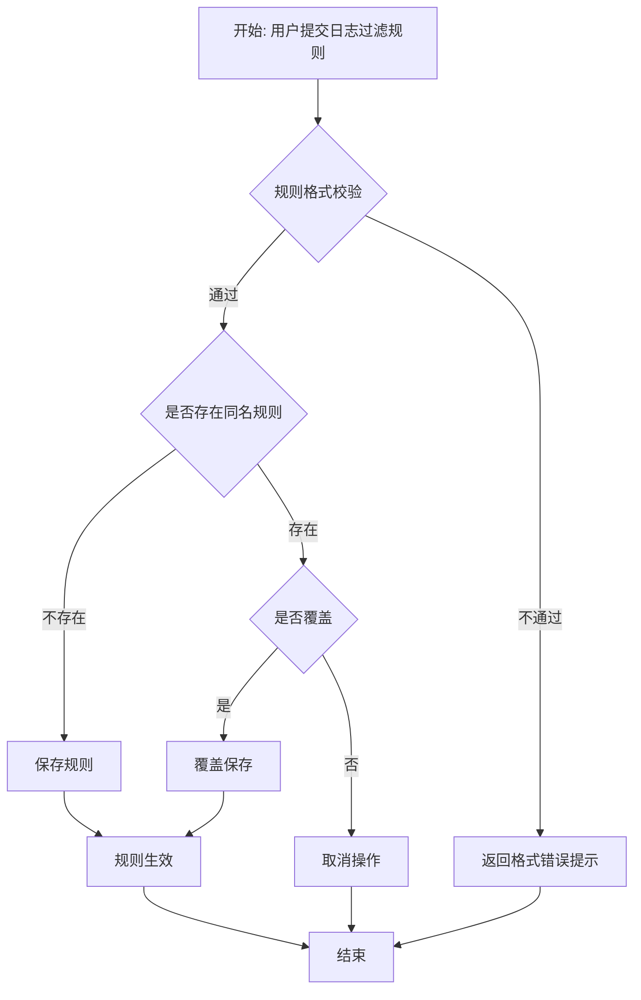

## 目标

对设计计划中 PPDCS 特征为 **P-Process** 的逻辑用例，执行四步设计过程，
建模业务流程→枚举路径→分配数据→输出物理用例。

## 理论基础

P-Process 是 PPDCS 五特征之一：
> 被测功能有"多步骤、有前后约束"的业务流程含义，
> 流程不可回退（区别于 S-State），步骤间有确定的顺序约束。

**识别条件**：需求描述包含"先...再..."、"如果...则..."、"流程"等词，
且流程不存在状态回退（回退则应使用 S-State）。

**建模工具**：流程图（flowchart）/ 活动图（activity diagram）

## 适用范围

- 适用阶段：MFQ 的 design 阶段
- 输入：`.workflow-meta/mfq/integration/design-plan.md`（PPDCS=P-Process 的 LC）
- 输出：`.workflow-meta/mfq/design/<module>/<sub-module>/` 目录下的设计文件

## 前置条件

- [ ] 设计计划已确认
- [ ] 当前逻辑用例的 PPDCS 特征为 P-Process

## 四步设计过程

### 第一步：流程图建模

使用 Mermaid flowchart 语法建模业务处理流程：

```markdown
## 流程图


```

**建模原则**：
- 使用 TD（top-down）布局
- 每个判断节点使用菱形 `{}`
- 每个处理节点使用方括号 `[]`
- 异常/错误路径也必须建模
- 过于复杂的流程（> 15 个节点）建议拆分子流程

### 第二步：路径枚举

枚举流程图中的所有执行路径：

```markdown
## 路径枚举表

| 路径编号 | 路径描述 | 经过节点 | 路径类型 |
|---------|---------|---------|---------|
| P1 | 正常创建新规则 | A→B(通过)→C(不存在)→E→I→J | 主路径 |
| P2 | 覆盖已有规则 | A→B(通过)→C(存在)→F(是)→G→I→J | 分支路径 |
| P3 | 取消覆盖 | A→B(通过)→C(存在)→F(否)→H→J | 分支路径 |
| P4 | 格式校验失败 | A→B(不通过)→D→J | 异常路径 |
```

**覆盖准则**：
- **语句覆盖**：每个节点至少经过一次（最低要求）
- **分支覆盖**：每个判断节点的每个分支至少经过一次（标准要求）
- **路径覆盖**：所有独立路径（推荐但路径过多时可剪枝）

### 第三步：路径数据分配

为每条路径分配具体的测试数据：

```markdown
## 路径数据表

| 路径 | 输入数据 | 预期输出 | 覆盖TP |
|------|---------|---------|--------|
| P1 | 规则名=rule_new, 条件=src_ip=10.0.0.1 | 创建成功，规则列表新增 rule_new | TP-M-003 |
| P2 | 规则名=rule_exist, 条件=src_ip=10.0.0.2, 覆盖=是 | 覆盖成功，规则内容更新 | TP-M-004 |
| P3 | 规则名=rule_exist, 覆盖=否 | 操作取消，原规则不变 | TP-M-004 |
| P4 | 规则名=空, 条件=无效格式 | 提示"规则格式错误" | TP-M-005 |
```

### 第四步：物理用例设计

将路径+数据转化为可执行的物理用例：

```markdown
### PC-FLT-RUL-001: 正常创建日志过滤规则

**优先级**：P1
**测试类型**：功能
**路径**：P1 — 正常创建新规则

**预置条件**：
1. 防火墙已正常启动
2. 无同名过滤规则

**测试步骤**：
| 步骤 | 操作 | 预期结果 |
|------|------|---------|
| 1 | 进入日志过滤规则配置页面 | 显示规则列表 |
| 2 | 点击"新建规则" | 显示规则配置表单 |
| 3 | 输入规则名=rule_new, 条件=src_ip=10.0.0.1 | 表单接受输入 |
| 4 | 点击"确定" | 提示"规则创建成功" |
| 5 | 查看规则列表 | rule_new 显示在列表中 |
```

## 输出目录结构

```
.workflow-meta/mfq/design/<module>/<sub-module>/
├── ppdcs-profile.md      # P-Process 特征详情
├── design-process.md      # 四步设计过程（含流程图、路径枚举、路径数据）
└── physical-cases.md      # 物理用例列表
```

### ppdcs-profile.md 内容

```markdown
# PPDCS 特征详情

- **主特征**：P-Process
- **判定依据**：<从 ppdcs-annotation.md 引用>
- **辅特征**：<如有>
- **流程节点数**：N
- **判断分支数**：M
- **预估路径数**：K
```

## 优先级分配规则

| 路径类型 | 优先级 |
|---------|--------|
| 主路径（最常用的正常路径） | P0~P1 |
| 关键分支路径 | P1~P2 |
| 异常/错误路径 | P2~P3 |
| 边界条件路径 | P3 |
| 极端/罕见路径 | P4 |

## 复杂度管理

- 节点数 > 15：建议拆分为主流程 + 子流程
- 路径数 > 20：使用分支覆盖作为最低要求，选择性执行路径覆盖
- 循环路径：取 0 次、1 次、N 次三种场景

## Gotchas

- 必须使用标准 Mermaid flowchart 语法，确保可渲染
- 隐式的异常路径也要建模（如超时、网络断开）
- 循环需要设定终止条件
- 路径描述中注明经过哪些判断分支的哪个方向
- **P-Process vs S-State 区分**：流程不可回退 = Process；可回退 = State

## 验收标准

- [ ] 流程图使用 Mermaid flowchart 语法且可渲染
- [ ] 所有判断分支均被至少一条路径覆盖
- [ ] 每条路径有具体的测试数据
- [ ] 物理用例包含优先级和测试类型
- [ ] `ppdcs-profile.md` 已创建
- [ ] 设计过程文档写入 `.workflow-meta/mfq/design/<module>/<sub>/`
