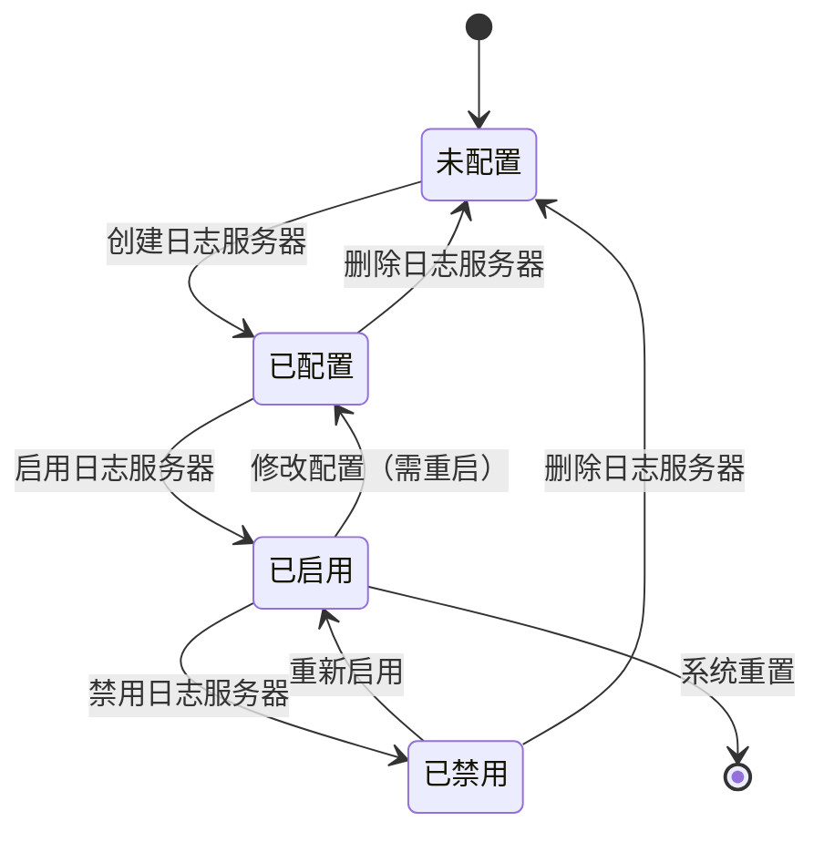

## 目标

对设计计划中标记为"状态图法"的逻辑用例，执行四步设计过程，
建模状态图→状态转换表→迁移路径数据→输出物理用例。

## 适用范围

- 适用阶段：MFQ 的 design 阶段
- 输入：`.mfq-work/integration/design-plan.md`（方法=状态图法的 LC）
- 输出：`.mfq-work/design/<module>/<sub-module>/` 目录下的设计文件

## 前置条件

- [ ] 设计计划已确认
- [ ] 当前逻辑用例的推荐方法为"状态图法"

## 四步设计过程

### 第一步：状态图建模

使用 Mermaid stateDiagram-v2 语法建模对象的状态变迁：

```markdown
## 状态图


```

**建模原则**：
- 使用 `[*]` 表示初始状态和终止状态
- 每条迁移标注触发事件
- 包含异常/非法迁移（用于负面测试）
- 状态数建议控制在 3~8 个

### 第二步：状态转换表

枚举所有合法和非法的状态转换：

```markdown
## 状态转换表

| 序号 | 当前状态 | 事件/动作 | 守卫条件 | 目标状态 | 转换类型 |
|------|---------|----------|---------|---------|---------|
| T1 | 未配置 | 创建日志服务器 | IP/端口有效 | 已配置 | 合法 |
| T2 | 已配置 | 启用日志服务器 | 配置完整 | 已启用 | 合法 |
| T3 | 已配置 | 删除日志服务器 | — | 未配置 | 合法 |
| T4 | 已启用 | 禁用日志服务器 | — | 已禁用 | 合法 |
| T5 | 已启用 | 修改配置 | 需重启生效 | 已配置 | 合法 |
| T6 | 已禁用 | 重新启用 | — | 已启用 | 合法 |
| T7 | 已禁用 | 删除日志服务器 | — | 未配置 | 合法 |
| T8 | 未配置 | 启用日志服务器 | 无配置 | — | **非法** |
| T9 | 未配置 | 禁用日志服务器 | 无配置 | — | **非法** |
```

**转换分类**：
- **合法转换**：系统应正常处理的状态变迁
- **非法转换**：系统应拒绝或优雅处理的状态变迁

### 第三步：迁移路径与数据分配

设计覆盖所有转换的测试路径和数据：

```markdown
## 迁移路径覆盖表

| 路径编号 | 路径描述 | 转换序列 | 测试数据 | 覆盖TP |
|---------|---------|---------|---------|--------|
| SP1 | 完整生命周期 | T1→T2→T4→T6→T7 | IP=10.0.0.1:514 | TP-M-010 |
| SP2 | 创建后修改再启用 | T1→T5→T2 | IP先=10.0.0.1后=10.0.0.2 | TP-M-011 |
| SP3 | 非法启用（未配置） | T8 | 直接点启用按钮 | TP-M-012 |
| SP4 | 非法禁用（未配置） | T9 | 直接点禁用按钮 | TP-M-012 |
```

**覆盖目标**：
- 所有合法转换至少覆盖 1 次
- 所有非法转换至少覆盖 1 次
- 至少 1 条路径覆盖完整生命周期（从初始到终止）

### 第四步：物理用例设计

将路径+数据转化为物理用例：

```markdown
### PC-SRV-STA-001: 日志服务器完整生命周期

**优先级**：P1
**测试类型**：功能
**路径**：SP1 — 创建→启用→禁用→重新启用→删除

**预置条件**：
1. 防火墙已正常启动
2. 无已配置的日志服务器

**测试步骤**：
| 步骤 | 操作 | 预期结果 |
|------|------|---------|
| 1 | 创建日志服务器 IP=10.0.0.1:514 | 状态变为"已配置" |
| 2 | 启用日志服务器 | 状态变为"已启用" |
| 3 | 禁用日志服务器 | 状态变为"已禁用" |
| 4 | 重新启用日志服务器 | 状态变为"已启用" |
| 5 | 删除日志服务器 | 状态变为"未配置" |
```

## 优先级分配规则

| 路径类型 | 优先级 |
|---------|--------|
| 完整生命周期路径 | P0~P1 |
| 基本合法转换 | P1 |
| 复合合法转换路径 | P2 |
| 非法转换（负面测试） | P2~P3 |
| 状态并发/竞争 | P3~P4 |

## 负面测试生成

自动检测非法转换并生成负面测试用例：

1. 枚举 (状态, 事件) 的全矩阵
2. 不在合法转换表中的组合 → 非法转换
3. 每个非法转换生成一个测试用例
4. 预期结果：系统拒绝操作或保持当前状态

## Gotchas

- 必须使用标准 Mermaid stateDiagram-v2 语法
- 注意状态的"可达性"：每个状态都应可从初始状态到达
- 注意"死状态"：不应存在进入后无法离开的状态（除终止状态外）
- 并发状态（如果有）需要特殊处理
- 守卫条件要明确，避免歧义

## 验收标准

- [ ] 状态图使用 Mermaid stateDiagram-v2 语法且可渲染
- [ ] 状态转换表包含所有合法和主要非法转换
- [ ] 迁移路径覆盖所有合法转换
- [ ] 包含至少 1 个非法转换的负面测试
- [ ] 物理用例包含优先级和测试类型
- [ ] 设计过程文档写入 `.mfq-work/design/<module>/<sub>/`
