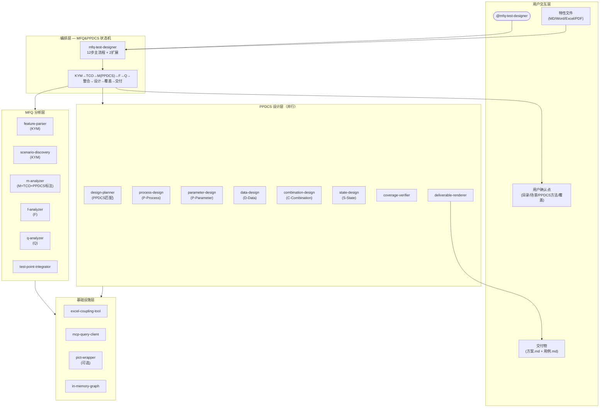

# 方案对比：MFQ 测试用例设计工具（v2 — 基于 MFQ&PPDCS 理论体系）

> 本次方案设计基于《海盗派测试分析: MFQ&PPDCS》（邰晓梅著）理论体系重构。
> 变更请求：CR-001

---

## 一、问题定义

### 1.1 问题陈述

当前测试设计实践中存在两个突出问题（来源：邰晓梅 2008 年调查）：
1. **薄弱的单功能分析**：测试人员不将被测对象细分为独立可测的单功能进行分析，只针对整体功能和非功能属性测试
2. **测试设计技术未被系统使用**：十几种成熟的测试设计技术（等价类、边界值、判定表、状态图等）未与被测对象特征匹配使用

MFQ&PPDCS 框架正是为解决这两个问题而提出：MFQ 提供三维度分析视角，PPDCS 提供单功能建模的特征匹配指导。

### 1.2 目标

| # | 目标 | 度量方式 | 来源 |
|---|------|---------|------|
| G1 | 实现完整的 MFQ&PPDCS 测试分析流程 | 覆盖 M(含PPDCS)+F+Q 全维度 | R3-R14 |
| G2 | 基于 PPDCS 特征自动推荐建模方法 | 5 种特征匹配准确率可验证 | 《海盗派》P183 |
| G3 | 支持三平台安装使用 | Copilot CLI + Claude Code + OpenClaw | R17-R18 |
| G4 | 需求到用例的双层可追溯覆盖 | SR→TP→LC→TD→PC 全链路 | R15 |
| G5 | 支持增量变更和问题单回溯 | 变更/问题不影响无关用例 | R19-R20 |

### 1.3 已知约束

| # | 约束 | 类型 | 影响范围 |
|---|------|------|---------|
| C1 | Copilot CLI v1.0.21 仅支持 `shell` 工具类型 | 平台 | Agent 工具声明 |
| C2 | 首版不引入 Neo4j，耦合图为内存模型 | 技术 | F 分析数据底座 |
| C3 | MCP 知识库首版仅定义查询契约 | 技术 | 场景搜索回退 Web |
| C4 | 试点产品限华为防火墙（TGFW/NGFW） | 业务 | 场景和耦合矩阵 |
| C5 | Excel 批注为耦合矩阵基线源 | 技术 | F 分析工具链 |

### 1.4 非目标（明确不做）

- 不实现 ISTQB 完整认证流程（仅借鉴测试设计技术分类）
- 不实现 KYM（了解测试任务）的自动化（首版由用户提供需求文件）
- 不实现自动代码依赖分析（F 分析的代码依赖源首版手动）
- 不实现 `自动化` 字段管理
- 不支持非华为防火墙产品

### 1.5 关键假设

| # | 假设 | 验证方式 | 若不成立的影响 |
|---|------|---------|---------------|
| A1 | 大部分防火墙单功能可归为 PPDCS 5 类之一 | 用日志中心特性实测 | 需增加"混合特征"处理逻辑 |
| A2 | 单功能的 PPDCS 特征可从需求描述中识别 | LLM 语义分析验证 | 需增加用户手动标注入口 |
| A3 | openpyxl 可稳定读取华为耦合矩阵 Excel | 已验证（522批注/509点） | 已有 zipfile+XML 回退 |
| A4 | PICT 工具可用于 C-Combination 组合生成 | 需运行时检测 | 回退到手动 pairwise 表 |

### 1.6 成功标准

| # | 标准 | 验收方式 |
|---|------|---------|
| S1 | 日志中心特性完整走通 MFQ&PPDCS 全流程 | 端到端测试 |
| S2 | 每个单功能的 PPDCS 特征标注准确 | 人工审核 |
| S3 | 生成的测试方案和用例覆盖率 = 100% | coverage-verifier 自动检查 |
| S4 | 三平台均可安装启动 | 平台安装验证 |

### 1.7 缺失信息

| # | 缺失项 | 级别 | 影响的设计决策 |
|---|--------|------|---------------|
| M1 | ISTQB PDF 尚未转为可读文本 | NICE-TO-HAVE | ISTQB 技术分类可从书中间接获取 |
| M2 | PICT 工具在 Windows 上的可用性 | NICE-TO-HAVE | C-Combination 可先手动建模 |

> ✅ 无 BLOCKING 级缺失信息，方案设计可继续。

---

## 二、候选方案

### 方案对比总览

| 对比维度 | 方案 A：MFQ&PPDCS 单Agent增强版 | 方案 B：KYM-TCO-MFQ 三阶段多Agent版 |
|---------|-------------------------------|--------------------------------------|
| 理论对齐度 | MFQ&PPDCS 完整覆盖 | 完整覆盖含 KYM + TCO |
| 复杂度模式 | complex | complex |
| Agent 数量 | 1 | 3 |
| Skill 数量 | 16 | 16（分配到 3 个 Agent） |
| Tool 数量 | 2~3 | 2~3 |
| **成本（开发量）** | 中（在 v1 基础上增量） | 高（需重建 Agent 调度层） |
| **扩展性** | 中（Skill 自包含可迁移） | 高（Agent 间天然隔离） |
| **风险 Top3** | ①上下文压力 ②PPDCS识别准确率 ③单Agent复杂度 | ①Agent间状态同步 ②Copilot CLI不支持sub-agent ③首版开发量大 |
| **实施周期** | ~18 Stories / 4 Waves | ~22 Stories / 5 Waves |
| **维护性** | 中（单入口易调试） | 中高（跨Agent调试复杂） |
| 适用场景 | 首版快速验证理论体系 | V2+ 大型特性处理 |

---

### 方案 A：MFQ&PPDCS 单 Agent 增强版（推荐）

#### 设计理念

在 v1 架构（1 Agent + 14 Skill）基础上，**增量集成 PPDCS 建模框架**：将 M 分析升级为"PPDCS 特征标注 + 建模指导"，将设计方法从 3 种扩展为 5 种（对齐 PPDCS 五特征），保持单一 Agent 入口不变。

#### 理论对齐

```
MFQ&PPDCS 框架                     工具实现映射
─────────────                     ────────────
KYM (了解测试任务)          ──→   feature-parser + scenario-discovery
                                   (用户提供需求 + 场景对齐)

TCO (测试覆盖大纲)          ──→   m-analyzer (输出三~五级目录 + 测试点)
                                   (TCO 即结构化的测试覆盖视图)

M  (单功能测试分析)          ──→   m-analyzer (PPDCS 特征标注)
 ├─ P-Process                ──→   process-design     (流程图法)
 ├─ P-Parameter              ──→   parameter-design   (判定表/因果图法)
 ├─ D-Data                   ──→   data-design        (等价类+边界值法)
 ├─ C-Combination            ──→   combination-design (Pairwise/正交法)
 └─ S-State                  ──→   state-design       (状态图法)

F  (功能交互分析)            ──→   f-analyzer (三源耦合)
Q  (质量属性分析)            ──→   q-analyzer (HTSM)

整合 + 设计 + 覆盖 + 交付    ──→   test-point-integrator + design-planner
                                   + coverage-verifier + deliverable-renderer

变更管理                      ──→   change-impact-analyzer + bug-gap-analyzer
```

#### 组件清单

**Agent（1 个）：**

| Agent 名称 | 职责 | 触发方式 |
|-----------|------|---------|
| mfq-test-designer | 主编排器：12 步状态机 + 2 扩展分支 | `@mfq-test-designer` |

**Skills（16 个）：**

| # | Skill 名称 | 职责 | PPDCS 对齐 | 触发词 |
|---|-----------|------|-----------|--------|
| 1 | feature-parser | 需求解析 + 三~五级目录 | KYM | 解析特性 |
| 2 | scenario-discovery | 场景分析（MCP/Web） | KYM | 场景分析 |
| 3 | m-analyzer | 单功能拆分 + **PPDCS 特征标注** + 测试点 | M + TCO | M分析 |
| 4 | f-analyzer | 三源耦合分析 | F | F分析 |
| 5 | q-analyzer | HTSM 质量属性 | Q | Q分析 |
| 6 | test-point-integrator | M+F+Q 归集 + 覆盖检查 | — | 整合测试点 |
| 7 | design-planner | **PPDCS 五特征匹配** + 用户确认 | PPDCS | 设计计划 |
| 8 | process-design | P-Process：流程图 + 路径覆盖 | P | 流程图设计 |
| 9 | parameter-design | P-Parameter：判定表/因果图/决策树 | P | 判定表设计 |
| 10 | data-design | D-Data：等价类 + 边界值 | D | 等价类设计 |
| 11 | combination-design | C-Combination：Pairwise/正交 | C | 组合设计 |
| 12 | state-design | S-State：状态图 + 转换表 | S | 状态图设计 |
| 13 | coverage-verifier | 双层覆盖检查 | — | 覆盖检查 |
| 14 | deliverable-renderer | 测试方案 + 测试用例 Markdown | — | 生成交付物 |
| 15 | change-impact-analyzer | 需求变更增量分析 | — | 需求变更 |
| 16 | bug-gap-analyzer | 问题单覆盖盲区 | — | 问题单分析 |

**Tools（2~3 个）：**

| Tool 名称 | 类型 | 用途 |
|----------|------|------|
| excel_coupling_tool.py | custom | Excel 耦合矩阵读写查询 |
| mcp_query_client.py | custom | MCP 知识库查询 |
| pict_wrapper.py（可选） | custom | PICT 工具封装（C-Combination） |

#### v1 → v2 变更对照

| v1 组件 | v2 组件 | 变更类型 |
|---------|---------|---------|
| m-analyzer | m-analyzer（增强） | **修改**：增加 PPDCS 特征标注输出 |
| design-planner | design-planner（增强） | **修改**：匹配逻辑从 3 种→5 种 |
| data-combination-design | **拆分为 3 个 Skill** | **拆分**：parameter-design + data-design + combination-design |
| flowchart-design | process-design（重命名） | **重命名**：对齐 P-Process |
| state-diagram-design | state-design（重命名） | **重命名**：对齐 S-State |
| — | pict_wrapper.py（可选） | **新增**：PICT 工具封装 |
| 其余 10 个 Skill | 不变 | — |

#### 12 步主流程（v2）

```
 1. input        特性文件解析 + 三~五级目录确认           [feature-parser]
 2. scenario     应用场景分析 + 用户确认                   [scenario-discovery]
 3. m-analysis   单功能拆分 + PPDCS特征标注 + 测试点      [m-analyzer]
 4. f-analysis   耦合关系分析（三源合并）                  [f-analyzer]
 5. q-analysis   质量属性分析（HTSM）                      [q-analyzer]
 6. integration  测试点归集 + 覆盖检查 + 逻辑合并          [test-point-integrator]
 7. plan         PPDCS五特征匹配推荐 + 用户确认            [design-planner]
 8. design       并行用例设计（5种PPDCS方法）              [5 design Skills]
 9. coverage     双层覆盖率验证                             [coverage-verifier]
10. delivery     交付物生成                                 [deliverable-renderer]
```

扩展分支不变：需求变更（change-impact-analyzer）+ 问题单分析（bug-gap-analyzer）

#### PPDCS 特征匹配规则（design-planner 核心逻辑）

```
对每个逻辑用例 LC：
  1. 读取 m-analyzer 标注的 PPDCS 主特征
  2. 按以下优先级匹配：
     ├── 涉及多状态互转？            → S-State    → state-design
     ├── 有业务流程（多步骤有序）？   → P-Process  → process-design
     ├── 参数参与规则判定？           → P-Parameter → parameter-design
     ├── 因子多、组合爆炸？           → C-Combination → combination-design
     ├── 数据有取值范围、独立验证？   → D-Data     → data-design
     └── 混合特征？                   → 主特征优先 + 辅特征补充
  3. 标注推荐方法 + 理由
  4. 汇总为设计计划表，交用户确认
```

#### 5 层架构图



#### 技术选型理由

| 技术决策 | 选择 | 选择原因 | 排除方案 | 排除原因 |
|---------|------|---------|---------|---------|
| 编排方式 | 单 Agent 状态机 | v1 已验证，三平台兼容 | 多 Agent 流水线 | 首版 Copilot CLI 适配困难 |
| PPDCS 识别 | LLM 语义分析 + 特征关键词匹配 | 零外部依赖 | 规则引擎 | 维护成本高 |
| C-Combination 工具 | PICT（可选） + 手动建模回退 | 业界标准 Pairwise 工具 | 自研组合算法 | 开发成本 |
| 模型输出格式 | Mermaid 图 + Markdown 表格 | 可直接渲染和评审 | JSON/YAML | 不直观 |
| 状态持久化 | `mfq/` 文件系统 | v1 已验证 | 数据库 | 过度设计 |

#### 优点

| 维度 | 评价 |
|------|------|
| 理论对齐 | ⭐⭐⭐⭐⭐ 完整覆盖 MFQ&PPDCS 原始框架 |
| 升级成本 | ⭐⭐⭐⭐ 在 v1 基础上增量，复用 10 个未变 Skill |
| 用户体验 | ⭐⭐⭐⭐⭐ 单一入口不变 |
| 平台兼容 | ⭐⭐⭐⭐⭐ 三平台无缝 |
| 方法选择准确性 | ⭐⭐⭐⭐ PPDCS 五特征比三方法更精准 |

#### 缺点/风险

- 单 Agent 上下文压力（16 Skill 提示词加载）
- PPDCS 特征识别依赖 LLM 语义理解，可能有误判
- P-Parameter（判定表/因果图）建模复杂，首版可能需要较多人工干预

#### 适用场景

当需要在已有 v1 基础上快速集成 PPDCS 理论体系，且首版开发周期有限时选择。

---

### 方案 B：KYM-TCO-MFQ 三阶段多 Agent 版

#### 设计理念

完全按照《海盗派》的 5 章结构（KYM → TCO → Modeling → TD → TE）设计 3 个独立 Agent：KYM Agent（了解任务+覆盖大纲）、MFQ Agent（分析+建模）、TD Agent（测试设计+交付），每个 Agent 独立管理上下文。

#### 组件清单

| Agent | Skill 数 | 职责 |
|-------|---------|------|
| kym-tco-agent | 3 | 任务理解 + 场景对齐 + 覆盖大纲 |
| mfq-analyzer-agent | 8 | M(PPDCS)+F+Q 分析 + 测试点整合 |
| td-designer-agent | 5 | 设计计划 + 5种PPDCS设计 + 覆盖 + 交付 |

#### 优点

- 上下文天然隔离，大型特性无压力
- 与理论体系章节一一对应
- 未来支持团队并行开发

#### 缺点

- Copilot CLI 无 sub-agent 协议，需 fallback
- Agent 间状态同步增加开发量 ~40%
- 用户需理解或等待 Agent 切换

---

## 三、方案推荐与理由

> 推荐方案：**方案 A — MFQ&PPDCS 单 Agent 增强版**

### 推荐理由（5 条）

1. **增量升级**：v1 已有 14 Skill 中 10 个无需改动，仅需拆分 1 个 + 增强 2 个 + 重命名 2 个，变更最小化
2. **理论完整**：完整覆盖 MFQ&PPDCS 五特征，KYM/TCO 通过 feature-parser + m-analyzer 隐式实现
3. **首版务实**：单入口、三平台兼容、用户学习成本为零
4. **PPDCS 精准匹配**：从 v1 的 3 种方法提升到 5 种 PPDCS 特征匹配，测试设计技术选择更科学
5. **演进预留**：Skill 自包含设计可无缝迁移到方案 B 的多 Agent 架构

### 推荐方案的局限性

- 单 Agent 上下文压力在大型特性（单功能 > 50 个）时可能显现
- PPDCS 特征混合情况（一个单功能同时具有 Process + Parameter 特征）需人工辅助判断
- P-Parameter 的判定表/因果图自动建模是 5 种方法中最复杂的

### 演进路径

```
v2 (当前) → v3 (拆分为 2 Agent: 分析Agent + 设计Agent) → v4 (方案 B 的 3 Agent 完整版)
```

---

## 四、推荐方案详细设计

> ⚠️ 本章在用户确认选定方案后展开。以下为预览。

### 4.1 M 分析增强：PPDCS 特征标注

m-analyzer 在生成测试点的同时，为每个单功能（五级目录节点）标注 PPDCS 主特征：

```markdown
| 单功能 | PPDCS 主特征 | 判定依据 | 辅特征 |
|--------|-------------|---------|--------|
| 日志服务器配置 | P-Parameter | 多参数规则判定（IP/端口/协议） | D-Data |
| 日志过滤流程 | P-Process | 过滤流程有步骤和分支 | — |
| 日志导出状态 | S-State | 导出任务有状态变迁 | — |
| 日志查询结果 | D-Data | 查询条件有取值范围 | C-Combination |
```

### 4.2 五种 PPDCS 设计 Skill 统一四步过程

| 步骤 | P-Process | P-Parameter | D-Data | C-Combination | S-State |
|------|-----------|-------------|--------|---------------|---------|
| 1.建模 | 流程图 | 判定表/因果图 | 等价类表 | 因子-状态表 | 状态图 |
| 2.推导 | 路径枚举 | 规则提取 | 边界值识别 | Pairwise生成 | 转换表 |
| 3.逻辑用例 | 路径→LC | 规则→LC | 等价类→LC | 组合→LC | 转换→LC |
| 4.物理用例 | LC→PC(P0~P4) | LC→PC | LC→PC | LC→PC | LC→PC |

---

## 五、分阶段实施计划

| 阶段 | 目标 | 关键任务 | 交付物 | 验收标准 |
|------|------|---------|--------|---------|
| 1 - 基础增强 | m-analyzer PPDCS 标注能力 | 增强 m-analyzer；增强 design-planner 五特征匹配 | 2 个增强 Skill | PPDCS 标注准确率 > 80% |
| 2 - 设计 Skill 拆分 | 5 种 PPDCS 设计能力 | 拆分 data-combination → parameter + data + combination；重命名 flowchart → process，state-diagram → state | 5 个设计 Skill | 每种方法四步过程完整 |
| 3 - 集成验证 | 端到端流程验证 | 用日志中心特性走通全流程 | 覆盖率报告 | SR 覆盖率 = 100% |
| 4 - 文档更新 | README + USER-MANUAL 同步 | 更新 PPDCS 相关内容 | 2 个文档 | PPDCS 描述完整 |

---

## 六、风险与应对

| # | 风险描述 | 潜在失败点 | 概率 | 影响 | 监控指标 | 应对策略 |
|---|---------|-----------|------|------|---------|---------|
| R1 | PPDCS 特征识别不准 | LLM 混淆 P-Process 和 S-State | 中 | 中 | 用户修正率 | 提供明确区分规则 + 用户确认 |
| R2 | P-Parameter 建模复杂 | 因果图/判定表自动生成困难 | 高 | 中 | 首版完成度 | 首版输出框架由用户补充细节 |
| R3 | 单 Agent 上下文溢出 | 16 Skill 同时加载 | 低 | 高 | token 使用率 | Skill 按需加载 + 文件持久化 |
| R4 | PICT 工具不可用 | Windows 环境安装失败 | 低 | 低 | 运行时检测 | 手动 pairwise 建模回退 |

---

## 七、待确认问题与下一步

### 待确认问题

| # | 问题 | 决策影响 | 建议默认值 |
|---|------|---------|-----------|
| Q1 | 是否需要将 ISTQB PDF 转换为可读文本作为参考 | 设计方法细节 | 否，从《海盗派》间接获取 |
| Q2 | P-Parameter 首版是否输出完整因果图或简化为判定表 | parameter-design 复杂度 | 简化为判定表 |
| Q3 | C-Combination 是否集成 PICT 工具 | combination-design 自动化程度 | 可选依赖，手动回退 |

### 下一步行动建议

1. 用户选择方案（A 或 B）
2. 选定后输出 SOLUTION-DESIGN.md + ARCHITECTURE-DECISION.md
3. 重新拆解受影响的 Story（预计 6-8 个 Story 受影响）
4. 增量实现（复用 v1 已验证代码）
