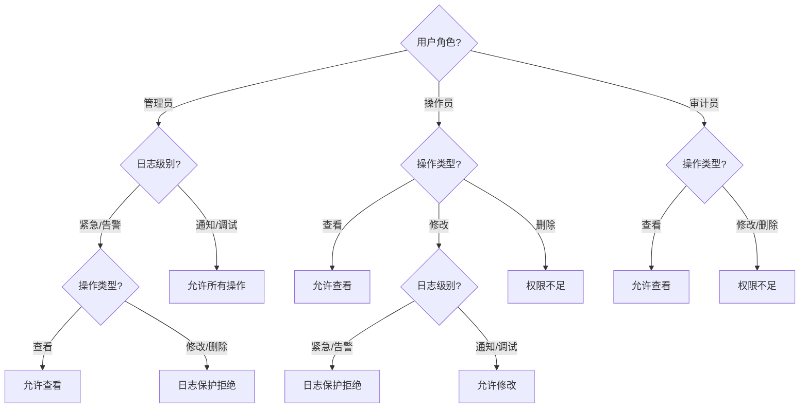

## 目标

对设计计划中 PPDCS 特征为 **P-Parameter** 的逻辑用例，执行四步设计过程，
提取参数规则→建立判定表→设计逻辑用例→输出物理用例。

## 理论基础

P-Parameter 是 PPDCS 五特征之一：
> 被测功能的输入参数参与业务规则判定，参数间存在关联关系，
> 不同参数组合导致不同的处理结果。

**识别条件**：需求描述中包含"当...且...则..."、"如果...则...否则..."
等条件-结果逻辑，且规则是确定性的（非概率）。

**关键区分**：
- P-Parameter vs D-Data — 参数间有规则关系？有 = Parameter，无/独立 = Data
- P-Parameter vs C-Combination — 规则确定？确定判定 = Parameter，需组合探索 = Combination
- P-Parameter vs P-Process — 是条件判定还是步骤流程？条件 = Parameter，步骤 = Process

**建模工具**：判定表（Decision Table）/ 因果图（Cause-Effect Graph）/ 决策树（Decision Tree）

## 适用范围

- 适用阶段：MFQ 的 design 阶段
- 输入：`.output/integration/design-plan.md`（PPDCS=P-Parameter 的 LC）
- 输出：`.output/design/<module>/<sub-module>/` 目录下的设计文件

## 前置条件

- [ ] 设计计划已确认
- [ ] 当前逻辑用例的 PPDCS 特征为 P-Parameter

## 四步设计过程

### 第一步：参数规则提取

从需求和逻辑用例描述中提取参与规则判定的参数和条件-结果关系：

```markdown
## 参数列表

| 参数编号 | 参数名称 | 取值范围 | 参与规则 |
|---------|---------|---------|---------|
| P1 | 用户角色 | 管理员/操作员/审计员 | R1, R2, R3 |
| P2 | 操作类型 | 查看/修改/删除 | R1, R2, R3 |
| P3 | 日志级别 | 紧急/告警/通知/调试 | R2 |
| P4 | 是否加密 | 是/否 | R3 |

## 业务规则

| 规则编号 | 规则描述 |
|---------|---------|
| R1 | 管理员可执行所有操作；操作员可查看和修改；审计员仅可查看 |
| R2 | 紧急/告警日志不可修改和删除（无论角色） |
| R3 | 加密日志仅管理员可查看原文，其他角色查看摘要 |
```

### 第二步：判定表建模

将参数和规则转化为判定表：

```markdown
## 判定表

### 条件桩与动作桩

| 条件/动作 | 规则1 | 规则2 | 规则3 | 规则4 | 规则5 | 规则6 | ... |
|-----------|-------|-------|-------|-------|-------|-------|-----|
| **条件** | | | | | | | |
| C1: 用户角色 | 管理员 | 管理员 | 操作员 | 操作员 | 审计员 | 审计员 | |
| C2: 操作类型 | 修改 | 删除 | 修改 | 删除 | 查看 | 修改 | |
| C3: 日志级别 | 通知 | 通知 | 通知 | 通知 | 任意 | 任意 | |
| C4: 是否加密 | — | — | — | — | 是 | — | |
| **动作** | | | | | | | |
| A1: 操作结果 | 成功 | 成功 | 成功 | 拒绝 | 查看摘要 | 拒绝 | |
| A2: 提示信息 | — | — | — | 权限不足 | — | 权限不足 | |
```

**简化规则**：
- 如果某条件不影响结果，用 `—` 标记（Don't Care）
- 合并规则：如果多列的条件组合产生相同动作，可合并
- 检查完整性：确保条件组合不遗漏

### 替代建模：因果图

当参数间存在复杂的逻辑关系时，可使用因果图：

```markdown
## 因果图

**原因（Causes）**：
- C1: 用户角色=管理员
- C2: 用户角色=操作员
- C3: 操作类型=查看
- C4: 操作类型=修改
- C5: 日志级别=紧急/告警

**结果（Effects）**：
- E1: 操作成功
- E2: 权限不足拒绝
- E3: 日志保护拒绝

**逻辑关系**：
- C1 AND C4 AND NOT C5 → E1
- C2 AND C4 AND C5 → E3
- C2 AND C4 AND NOT C5 → E1
- NOT C1 AND NOT C2 AND C4 → E2
```

### 替代建模：决策树

当条件有层次结构时，可使用决策树：

```markdown
## 决策树


```

### 第三步：逻辑用例设计

将判定表的每条规则（或每条路径）转化为逻辑用例：

```markdown
## 逻辑用例

| LC-ID | 用例标题 | 条件组合 | 预期动作 | 覆盖TP | 规则 |
|-------|---------|---------|---------|--------|------|
| LC-001-01 | 管理员修改通知日志 | 角色=管理员,操作=修改,级别=通知 | 修改成功 | TP-M-001 | R1 |
| LC-001-02 | 操作员删除通知日志 | 角色=操作员,操作=删除,级别=通知 | 权限不足拒绝 | TP-M-002 | R1 |
| LC-001-03 | 管理员修改紧急日志 | 角色=管理员,操作=修改,级别=紧急 | 日志保护拒绝 | TP-M-003 | R2 |
```

### 第四步：物理用例设计

```markdown
### PC-LOG-PRM-001: 管理员修改通知级别日志

**优先级**：P1
**测试类型**：功能
**规则**：R1 — 管理员可执行所有操作

**预置条件**：
1. 防火墙已正常启动
2. 存在通知级别的日志记录
3. 管理员账号已登录

**测试步骤**：
| 步骤 | 操作 | 预期结果 |
|------|------|---------|
| 1 | 使用管理员账号登录日志管理界面 | 登录成功 |
| 2 | 选择一条通知级别的日志 | 日志详情显示 |
| 3 | 点击"修改"，修改日志描述 | 修改框可编辑 |
| 4 | 点击"保存" | 提示"修改成功" |
| 5 | 刷新日志列表 | 日志内容已更新 |
```

## 输出目录结构

```
.output/design/<module>/<sub-module>/
├── ppdcs-profile.md      # P-Parameter 特征详情
├── design-process.md      # 四步设计过程（含判定表/因果图/决策树）
└── physical-cases.md      # 物理用例列表
```

### ppdcs-profile.md 内容

```markdown
# PPDCS 特征详情

- **主特征**：P-Parameter
- **判定依据**：<参数间存在业务规则关系>
- **辅特征**：<如有>
- **参数数**：N
- **业务规则数**：M
- **建模方法**：判定表 / 因果图 / 决策树
- **判定表列数**：K（规则组合数）
- **简化后列数**：J
```

## 建模方法选择

| 条件 | 推荐建模方法 |
|------|------------|
| 参数少（≤4）、规则直观 | 判定表 |
| 参数间有复杂逻辑关系 | 因果图 → 转判定表 |
| 条件有层次结构 | 决策树 |

## 优先级分配规则

| 规则类型 | 优先级 |
|---------|--------|
| 最常见的条件组合（正常路径） | P1 |
| 权限相关的拒绝规则 | P1~P2 |
| 特殊保护规则（如日志保护） | P2 |
| 边界条件组合 | P2~P3 |
| Don't Care 条件的验证 | P3 |

## 判定表完整性检查

1. **条件组合完整性**：所有可能的条件组合在判定表中有对应
2. **一致性**：同一条件组合不应有矛盾的动作
3. **Don't Care 处理**：标记为 `—` 的条件确实不影响结果
4. **冗余检查**：合并相同动作的规则列

## Gotchas

- P-Parameter 关注的是"确定性规则"，不是概率/模糊规则
- 判定表列数过多时（> 32），考虑拆分子表或使用因果图简化
- Don't Care（`—`）意味着"无论取何值结果相同"，需要验证
- 规则优先级：如果存在规则冲突，需要确认优先级
- 与 D-Data 区分：Data 的参数独立无规则关系，Parameter 的参数有规则关系

## 验收标准

- [ ] 参数列表和业务规则完整提取
- [ ] 判定表/因果图/决策树建模正确
- [ ] 判定表完整性检查通过
- [ ] 逻辑用例覆盖所有判定规则
- [ ] 物理用例包含优先级和测试类型
- [ ] `ppdcs-profile.md` 已创建
- [ ] 设计过程文档写入 `.output/design/<module>/<sub>/`
