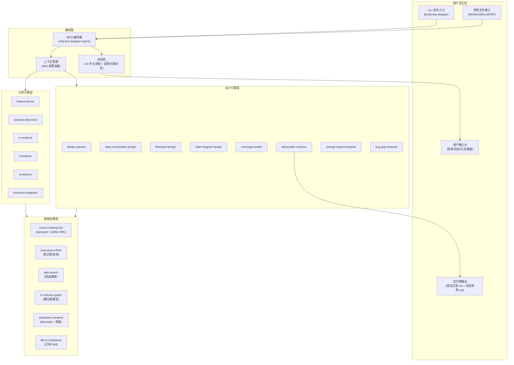
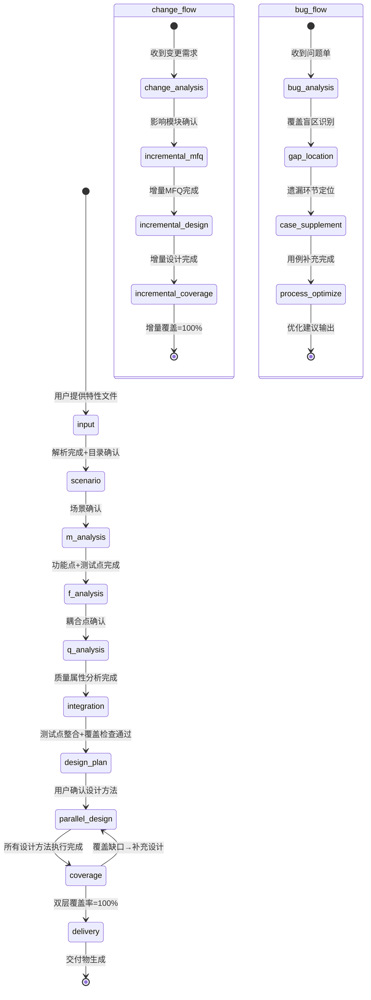
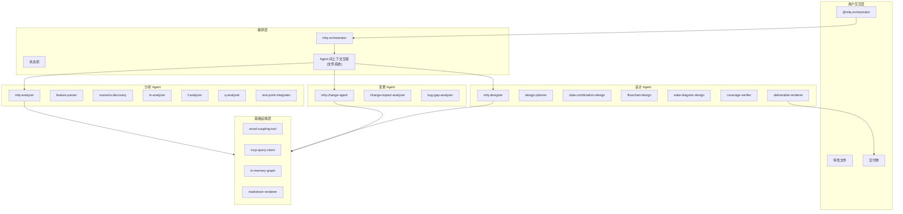

# 方案对比：MFQ 测试用例设计工具

## 复杂度判定

| 判定维度 | 实际情况 | 判定结果 |
|---------|---------|---------|
| 目标数量 | 20 条需求，覆盖输入解析、MFQ 三阶段分析、三种设计方法、覆盖验证、交付、变更管理 | **complex** |
| 角色数量 | 3 个用户画像（测试架构师、测试工程师、测试经理） | **complex** |
| 状态流转 | 10 步主流程 + 变更分支 + 问题单分支，含多个用户确认点 | **complex** |
| 平台适配差异 | Copilot CLI / Claude Code / OpenClaw 三平台，Agent 格式和工具声明方式各异 | **complex** |
| Story 拆解必要性 | 是 — 需按里程碑 M1~M6 分批交付 | **complex** |

**最终判定：`complex`** — 需要多 Agent 或多 Skill 协作，Story 拆解开发，分 Wave 交付。

---

## 方案 A：单编排 Agent + 多 Skill 架构（推荐）

### 产物形态

| 类型 | 数量 | 说明 |
|------|------|------|
| Agent | 1 | `mfq-test-designer`（主编排器，承载状态机 + 用户交互） |
| Skill | 14 | 每个分析/设计/验证能力封装为独立 Skill |
| Python 工具 | 2 | Excel 批注读写器、MCP 查询客户端 |

### Agent / Skill 分解

```
mfq-test-designer (编排 Agent)
│
├── 输入阶段 Skills
│   ├── feature-parser          ← R1  特性文件解析 + 目录结构构建
│   └── scenario-discovery      ← R2, R17  场景分析（MCP → WebSearch 回退）
│
├── MFQ 分析阶段 Skills
│   ├── m-analyzer              ← R3  模块/功能点分析 + 测试点生成
│   ├── f-analyzer              ← R4~R8  耦合分析（三源合并 + 图模型 + 确认回写）
│   └── q-analyzer              ← R9  质量属性分析（HTSM 维度）
│
├── 整合阶段 Skills
│   ├── test-point-integrator   ← R10  测试点归集 + 覆盖检查 + 逻辑合并
│   └── design-planner          ← R11  设计方法推荐 + 用户确认
│
├── 设计阶段 Skills（可并行）
│   ├── data-combination-design ← R12  等价类划分 + 数据组合 + 四步设计
│   ├── flowchart-design        ← R13  流程图 + 路径覆盖 + 四步设计
│   └── state-diagram-design    ← R14  状态图 + 转换表 + 四步设计
│
├── 验证与交付 Skills
│   ├── coverage-verifier       ← R15  双层覆盖率检查
│   └── deliverable-renderer    ← R16  测试方案 + 测试用例 Markdown 生成
│
└── 变更管理 Skills
    ├── change-impact-analyzer  ← R19  需求变更影响分析 + 增量 MFQ + 增量设计
    └── bug-gap-analyzer        ← R20  问题单覆盖盲区分析 + 用例补充 + 流程优化
```

### 5 层架构图



### 状态机流程



### 优势

| 维度 | 评价 |
|------|------|
| 用户体验 | ⭐⭐⭐⭐⭐ 单一入口，用户只需与 1 个 Agent 对话 |
| 平台兼容 | ⭐⭐⭐⭐⭐ 三平台均天然支持"1 Agent + 多 Skill"模式 |
| 上下文共享 | ⭐⭐⭐⭐ Agent 天然持有全流程上下文，Skill 间无需额外传递 |
| 首版开发成本 | ⭐⭐⭐⭐ 无 Agent 间协调开销，聚焦 Skill 实现 |
| 可扩展性 | ⭐⭐⭐ 新能力只需新增 Skill，但单 Agent 上下文有压力 |
| 并行能力 | ⭐⭐⭐ 三种设计方法可逻辑并行（用户依次执行或 /fleet） |

### 劣势

- 大型特性（测试点 > 200）时，单 Agent 上下文窗口可能不足
- 所有 Skill 的提示词加载到同一 Agent，token 预算需精细管理
- 未来扩展为团队协作时，单 Agent 模式需重构

### 缓解措施

- Skill 按需加载（仅激活当前阶段的 Skill 提示词）
- 中间产物持久化到文件系统（`.mfq-work/`），降低上下文依赖
- 预留 Agent 拆分接口（Skill 设计为自包含，未来可独立挂载到子 Agent）

---

## 方案 B：多 Agent 流水线 + 共享 Skill 架构

### 产物形态

| 类型 | 数量 | 说明 |
|------|------|------|
| Agent | 4 | 编排器 + 分析 Agent + 设计 Agent + 变更 Agent |
| Skill | 14 | 同方案 A，但由不同 Agent 调度 |
| Python 工具 | 2 | 同方案 A |

### Agent 分解

```
mfq-orchestrator (薄编排 Agent — 状态机 + 用户交互)
│
├── mfq-analyzer (分析 Agent — M/F/Q 全阶段)
│   ├── feature-parser
│   ├── scenario-discovery
│   ├── m-analyzer
│   ├── f-analyzer
│   ├── q-analyzer
│   └── test-point-integrator
│
├── mfq-designer (设计 Agent — 设计计划 + 三种方法 + 覆盖 + 交付)
│   ├── design-planner
│   ├── data-combination-design
│   ├── flowchart-design
│   ├── state-diagram-design
│   ├── coverage-verifier
│   └── deliverable-renderer
│
└── mfq-change-agent (变更管理 Agent — 变更 + 问题单)
    ├── change-impact-analyzer
    └── bug-gap-analyzer
```

### 5 层架构图



### 优势

| 维度 | 评价 |
|------|------|
| 上下文隔离 | ⭐⭐⭐⭐⭐ 每个 Agent 仅加载自身阶段的上下文 |
| 可扩展性 | ⭐⭐⭐⭐⭐ 新阶段新增 Agent 即可，不影响已有 Agent |
| 并行能力 | ⭐⭐⭐⭐ 分析完成后设计 Agent 可独立运行 |
| 团队协作 | ⭐⭐⭐⭐ 不同开发者可独立开发不同 Agent |

### 劣势

| 维度 | 评价 |
|------|------|
| 用户体验 | ⭐⭐⭐ 用户需理解多 Agent 切换或依赖编排器自动调度 |
| 平台兼容 | ⭐⭐⭐ Copilot CLI 的 Agent 间调度能力有限（无原生 sub-agent 协议） |
| 首版开发成本 | ⭐⭐ Agent 间状态同步、上下文交接增加开发量 |
| 调试复杂度 | ⭐⭐ 跨 Agent 问题定位困难 |

### 劣势缓解

- Agent 间通过 `.mfq-work/` 目录下的 YAML/MD 文件交换上下文
- 编排器维护全局 `FLOW-STATE.md`，记录当前所处 Agent 和阶段
- 为 Copilot CLI 提供 fallback 模式（所有 Skill 合入单 Agent）

---

## 方案对比总结

| 对比维度 | 方案 A（单 Agent + 多 Skill） | 方案 B（多 Agent 流水线） |
|---------|---------------------------|------------------------|
| Agent 数量 | 1 | 4 |
| Skill 数量 | 14 | 14（相同） |
| 用户入口 | 单一 `@mfq-test-designer` | `@mfq-orchestrator` 自动调度 |
| 上下文管理 | Agent 内共享，Skill 按需激活 | Agent 间文件交换，各自独立 |
| 平台兼容性 | ✅ 三平台均原生支持 | ⚠️ Copilot CLI 需 fallback |
| 首版开发量 | 中等 | 较大（+Agent 协调层） |
| 未来扩展 | 需拆分 Agent（重构） | 天然支持 |
| 大特性处理 | ⚠️ 上下文压力（可缓解） | ✅ 天然隔离 |
| 团队并行开发 | ⚠️ 需协调 Skill 接口 | ✅ Agent 独立开发 |

## 推荐

**推荐方案 A（单编排 Agent + 多 Skill 架构）**

理由：
1. **首版务实**：用户只需与 1 个 Agent 交互，学习成本最低
2. **平台无缝**：三平台均原生支持"1 Agent + N Skill"，无需 Agent 间协议适配
3. **开发聚焦**：省去 Agent 间状态同步和上下文交接开发，聚焦核心 MFQ 能力
4. **演进预留**：Skill 设计为自包含（有独立前置条件和输出契约），未来可无缝拆分到子 Agent

方案 B 作为 V2 演进方向保留 — 当首版在大型特性上遇到上下文瓶颈时，可将已有 Skill 迁移到独立 Agent 中，成本可控。
