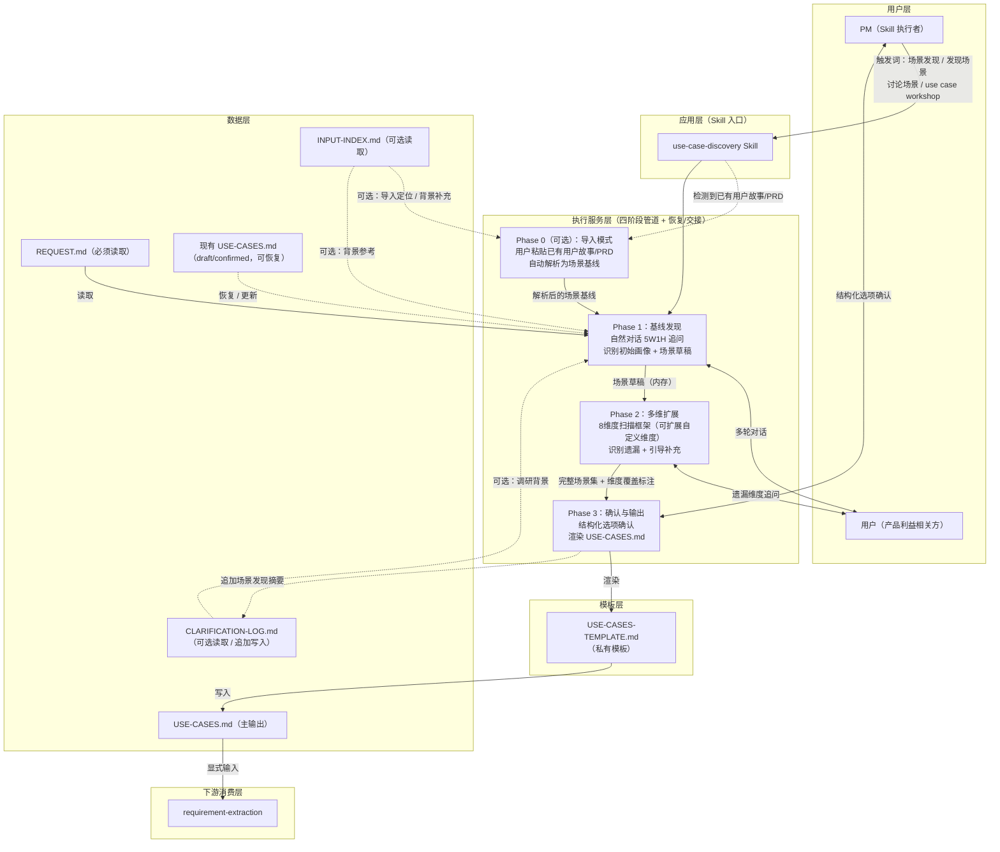
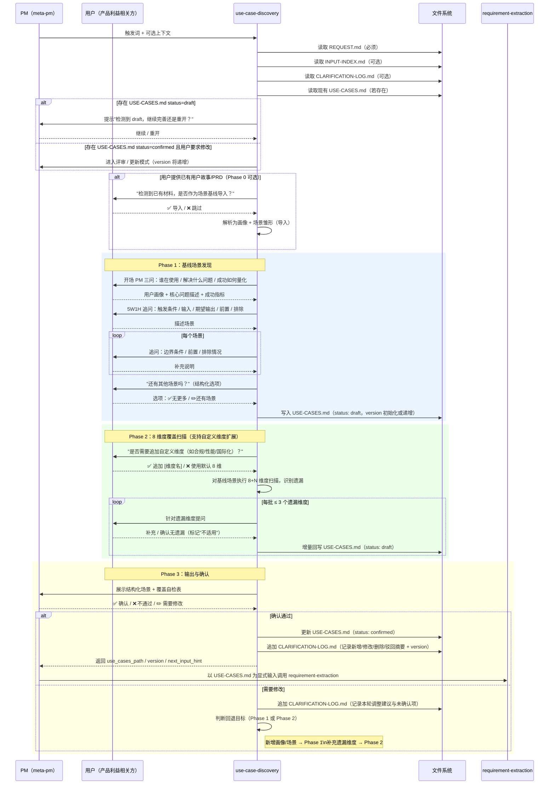

# 高层设计（HLD）：use-case-discovery Skill

> 基于用户需求描述输出。由 meta-se 在 solution-design 阶段生成。
> HLD 经人工确认（`confirmed=true`）后，方可进入 Story 拆解阶段。

## 修订记录

| 版本 | 日期 | 修订人 | 关键变更 |
|------|------|--------|---------|
| 1.0 | 2026-04-22 | meta-se | 初稿，方案 A/B/C 对比并选定 C（渐进式多维发现） |
| 1.1 | 2026-04-22 | meta-se | 基于 awesome-copilot 分析补充 §6/§10/§11/§14 借鉴清单 |
| 1.2 | 2026-04-22 | design-review | 设计评审后修订：① 补充 meta-pm 集成契约（§3.1 新增 "与 meta-pm 的集成契约"、§5 新增模块 M5、§11 新增阶段 5）；② 量化 P0 目标度量指标（§1 成功标准）；③ 修复 ADR-1 与 R4 关于"覆盖自检表"HTML 注释的矛盾（ADR-1 改为"可见附录 + 机器可读锚点"）；④ 明确 Phase 1 草稿落盘策略（§5 模块边界规则、§8 可靠性）；⑤ 补充 Phase 0 导入模式在主流程中的表达（§7 可选入口）；⑥ 补充失败路径与前置校验（§7.3）；⑦ 明确 8 维度理论依据（§7 脚注）；⑧ 与 requirement-clarifier 的边界澄清（§1 非目标）；⑨ Story 数与交付阶段对齐（§12 重新拆分为 3 Stories）；⑩ 补充 Gotchas 候选清单（§14.2）；⑪ 语言策略显式化（§6 新增项）。 |
| 1.3 | 2026-04-22 | design-review | 根据用户答复收敛 Q4–Q8：**Q4** meta-pm.md 场景发现子流程完全替换为调用本 Skill（§3.1 降级策略改为"激活失败时终止并报错"）；**Q5** 覆盖自检表写入 meta-pm.md 的 USE-CASES.md 正式规范（§11 新增阶段 5 meta-pm.md 规范同步）；**Q6** Phase 0 导入模式纳入 MVP（§4 架构图、§5 新增 Phase 0 模块、§7 主流程补分支、§11 阶段 1 范围扩展）；**Q7** 对话语言固定中文，用户显式要求时切换英文（§6 语言策略定稿）；**Q8** 允许会话中临时追加自定义维度（§7 8 维度框架补充扩展机制、新增 ADR-6）。同步更新 §12 工作量、§13 清理已决 Q4–Q8。 |
| 1.4 | 2026-04-22 | design-review | 收敛 3 个二级决策（A/B/C）：**A** Phase 0 导入来源 MVP 仅支持粘贴文本，文件路径留后续迭代（§5 Phase 0 输入契约、§7 主流程备注）；**B** 用户自定义维度软性上限 ≤ 2，超过则提示走 CR 正式化（§7 8 维度表注、ADR-6 补充）；**C** meta-pm.md 保留 3–5 行引导文本再触发 Skill，不直接跳转（§3.1 "调用方式"、§11 阶段 3 完成准则）。 |
| 1.5 | 2026-04-22 | design-review | 二轮评审修订：① 补齐上下游契约，新增 `INPUT-INDEX.md` / 现有 `USE-CASES.md` 的输入与恢复规则，并明确 `requirement-extraction` 必须显式消费 `USE-CASES.md`（§1、§3.1、§4、§5、§11、§12、ADR-8/9）；② 修复文档内冲突：M5 仍写"降级兜底"、复杂度表 Story 数、Phase 1/2 draft 写入时机与时序图不一致、`template-source: fallback` 破坏内容契约（§3、§5、§7.1、§7.3）；③ 补充恢复/重入路径与与相邻 Skill 的边界隔离（§6、§7、§9）；④ 新增遗留问题 Q9：场景发现摘要是否应进入 `CLARIFICATION-LOG.md`（§13）。 |
| 1.6 | 2026-04-22 | design-review | 根据用户决策收敛 Q9：**需要追加**。将场景发现摘要追加写入 `CLARIFICATION-LOG.md` 作为正式日志契约（§3.1、§4、§5、§7、§8、§10、§11、§13 同步更新），并清理 open 遗留问题状态。 |

---

## 1. 问题定义

### 问题陈述

在 SCOPE-Pack 元工作流中，meta-pm 的场景发现能力（阶段一）当前以**线性追问**方式内嵌于 Agent 指令文本，缺乏结构化的多维度头脑风暴框架。这导致三类问题：
- 容易遗漏少数用户群体（非主流画像）、异常路径（错误输入/边界条件）或跨系统集成场景
- 场景发现质量强依赖当次会话中 PM 的即兴判断，跨项目执行质量不一致
- 该能力无法作为独立 Skill 被单独调用或测试，维护成本隐式分摊在 meta-pm 全量上下文中

### 核心价值

通过提供一套**渐进式多维度场景发现框架**，帮助 PM 系统化地与用户共同探索使用场景，保证发现过程覆盖完整，减少需求阶段场景遗漏，并以可复用 Skill 形态沉淀为工程制品。

### 目标

| 优先级 | 目标 | 度量方式 |
|--------|------|---------|
| P0 | 提供可重复执行的场景发现流程，输出标准化 `USE-CASES.md` | USE-CASES.md 可通过 meta-pm 验收清单检验 |
| P0 | 通过 8 维度扫描检测场景覆盖遗漏 | 每个 USE-CASES.md 包含覆盖维度自检表 |
| P1 | 以独立可调用 Skill 形态实现，与 meta-pm 松耦合 | 可脱离 meta-pm 独立触发并产出 USE-CASES.md |
| P2 | 支持多轮迭代，用户可在任意轮次补充或修正场景 | 场景修订不破坏已有场景的结构 |

### 成功标准

- [ ] 每次执行后 `USE-CASES.md` 包含不少于 1 个用户画像和 1 个可量化成功指标（含目标值，如"节省 50% 时间"）
- [ ] 8 个维度 100% 被处理（覆盖、补充或显式标注"不适用"），无维度被静默跳过
- [ ] 每个场景包含全部 7 个必填字段：角色、触发条件、输入、处理逻辑、输出/结果、前置条件、排除情况
- [ ] `USE-CASES.md` 格式与 `meta-pm.md` 中的 USE-CASES 结构规范 **字段级一致**（新增字段仅作为可选附录，不破坏必填字段集）
- [ ] **集成度量**：meta-pm 在 requirement-clarification 阶段能够通过触发词调用本 Skill，并在 Skill 完成后以 `process/USE-CASES.md` 作为显式输入无缝衔接 `requirement-extraction`
- [ ] **恢复度量**：再次触发时，若存在 `USE-CASES.md status=draft`，Skill 能从草稿恢复并继续，而不是重复从零开始访谈

### 约束

| 类型 | 约束内容 |
|------|---------|
| 技术 | 仅通过结构化对话和文件操作实现，不依赖外部 API 或 MCP 服务 |
| 业务 | 只负责场景发现与确认，不越界到需求结构化（`requirement-extraction` 职责）|
| 协议 | 输出必须与 `meta-pm.md` 中的 `USE-CASES.md` 结构规范兼容，不引入新字段语义 |
| 集成 | 场景发现结果必须通过正式工件 `USE-CASES.md` 交接给下游，不依赖 meta-pm 二次转述 |
| 资源 | 单个 Skill 文件（`SKILL.md`）+ 私有模板，不拆分子 Skill |

### 非目标（Out of Scope）

- 从场景提取结构化需求条目 → `requirement-extraction` 的职责
- 生成**针对已确认需求**的澄清问题 → `requirement-clarifier` 的职责（本 Skill 的 8 维度追问仅用于**场景发现阶段**补全盲点，不处理需求语义歧义或未决问题清单）
- 展开测试场景 → `scenario-expansion` 的职责
- 生成 `SCENARIOS.yaml` / `TEST-MATRIX.md` 等测试覆盖产物 → `scenario-expansion` 的职责
- 管理多轮澄清日志 → `requirement-clarifier` + meta-pm 的职责
- 自动评估场景优先级或商业价值
- 执行阶段零快速调研（由 meta-pm 在调用本 Skill 前完成）

### 关键假设

- meta-pm 在调用此 Skill 前已完成阶段零快速调研（CLARIFICATION-LOG.md 存在）
- 用户能够以自然语言描述自己的工作场景和目标
- 场景完整性由 PM + 用户共同确认，AI 不单方面声称场景已完整

### 缺失信息

| 优先级 | 缺失信息 | 影响范围 | 决策所需时限 |
|--------|---------|---------|------------|
| OPTIONAL | 是否需要支持从已有用户故事/PRD 批量导入作为发现起点 | 影响"Phase 0：定向"的步骤设计 | 可在 LLD 阶段决策 |
| OPTIONAL | 是否需要输出场景优先级排序建议 | 影响 USE-CASES.md 输出模板扩展 | 可后续迭代 |

---

## 2. 候选架构方案对比

### 方案 A：顺序追问（Sequential Questioning）

**核心思路**：将 meta-pm.md 中现有的线性追问逻辑原样抽取为独立 Skill，保持单场景逐一追问方式。

| 维度 | 评估 |
|------|------|
| 优点 | 实现极简；与现有 meta-pm.md 逻辑几乎零差异；用户习惯改变最小 |
| 缺点 | 无多维度覆盖保证；场景遗漏风险原样保留；质量依赖 PM 主动性 |
| 复杂度 | low |
| 实施成本 | 极低（主要是文件抽取与格式整理）|
| 可扩展性 | 差（增加新维度需修改核心流程逻辑）|
| 风险 | 未解决核心痛点：场景覆盖不完整 |
| 适用前提 | 产品极简，用户类型单一，场景数量 ≤ 3 |

### 方案 B：多维度工作坊（Multi-Dimensional Workshop）

**核心思路**：设计一套完整的多维度场景发现框架，PM 按框架顺序引导用户完成：画像矩阵构建 → 8 维度头脑风暴 → 异常雷达检测 → 场景完整性验证。全程结构化，不依赖对话即兴。

| 维度 | 评估 |
|------|------|
| 优点 | 系统化覆盖；可重复执行；质量稳定；可独立调用；天然支持多画像 |
| 缺点 | 执行步骤多；用户需配合完成多个环节；对简单产品显得过重 |
| 复杂度 | medium-high |
| 实施成本 | 中高（需设计 8 维框架、画像矩阵、覆盖检查逻辑）|
| 可扩展性 | 好（维度模板解耦，新增维度不影响主流程）|
| 风险 | 对话轮次多，用户可能在中途失去耐心 |
| 适用前提 | 产品复杂度 medium 以上；多用户类型；场景发现完整性为主要关切 |

### 方案 C：渐进式多维发现（Progressive Multi-Dimensional Discovery）

**核心思路**：两阶段渐进设计。Phase 1 以自然对话快速建立场景基线（与 meta-pm 现有方式兼容）；Phase 2 用 8 维度扫描框架系统检测基线遗漏，在自然对话流畅性与结构化覆盖保证之间取得平衡。最后输出含覆盖自检表的 `USE-CASES.md`。

| 维度 | 评估 |
|------|------|
| 优点 | 兼顾自然对话体验与系统覆盖；早期输出草稿；遗漏维度可见；与现有 meta-pm 结构衔接最自然 |
| 缺点 | 两阶段边界需清晰设计；比方案 A 复杂；需设计 8 维框架 |
| 复杂度 | medium |
| 实施成本 | 中（两阶段设计 + 8 维框架 + 覆盖自检表）|
| 可扩展性 | 好（两阶段独立，可按需扩展维度或阶段）|
| 风险 | 两阶段过渡如设计不清晰，用户会有重复感；需明确阶段切换触发条件 |
| 适用前提 | 适用于任何复杂度产品，是通用默认选择 |

### 方案对比矩阵

| 维度 | 方案 A（顺序追问）| 方案 B（多维工作坊）| 方案 C（渐进多维）|
|------|:---:|:---:|:---:|
| 场景覆盖完整性 | ⭐⭐ | ⭐⭐⭐⭐⭐ | ⭐⭐⭐⭐ |
| 实现难度 | ⭐ | ⭐⭐⭐⭐ | ⭐⭐⭐ |
| 用户体验友好性 | ⭐⭐⭐⭐ | ⭐⭐⭐ | ⭐⭐⭐⭐ |
| 可复用性 | ⭐⭐⭐ | ⭐⭐⭐⭐⭐ | ⭐⭐⭐⭐ |
| 与现有结构兼容 | ⭐⭐⭐⭐⭐ | ⭐⭐⭐ | ⭐⭐⭐⭐ |
| 质量稳定性 | ⭐⭐ | ⭐⭐⭐⭐⭐ | ⭐⭐⭐⭐ |
| 适用范围 | 极简产品 | 复杂产品 | **通用** |

**推荐方案**：方案 C（渐进式多维发现），理由：在保持自然对话体验的前提下提供系统化场景覆盖，与现有 meta-pm.md 结构兼容衔接最优，同时适用于任意复杂度产品。

---

## 3. 推荐方案总览

### 3.1 与 meta-pm 的集成契约（v1.2 新增）

> 本节回应用户需求核心：**"meta-pm 具备完整的与用户沟通用户场景并输出用户场景的 Skill"**。
> Skill 与 meta-pm 的关系并非简单"独立可调用"，必须有明确的集成契约。

| 契约维度 | 约定 |
|---------|------|
| 调用方向 | meta-pm（调用方）→ use-case-discovery（Skill 执行方） |
| 调用时机 | meta-pm 完成阶段零快速调研（CLARIFICATION-LOG.md 已写入）后，进入场景发现环节时 |
| 调用方式 | meta-pm 识别用户意图或推进信号后，**先输出 3–5 行引导文本**（说明即将进入"场景发现"Skill、预期耗时与产出），再通过触发词（见 ADR-5）自动激活本 Skill（C 已决）|
| 输入契约 | REQUEST.md（必读）+ INPUT-INDEX.md（若存在则用于定位原始材料）+ CLARIFICATION-LOG.md（若存在则读取调研上下文）+ 现有 USE-CASES.md（若存在则用于恢复/更新） |
| 输出契约 | `process/USE-CASES.md`（draft / confirmed）+ 会话内结构化完成摘要（供 meta-pm 编排下一步） |
| 后续衔接 | meta-pm 收到 Skill 完成信号后，**以 `process/USE-CASES.md` 为显式输入** 调用 `requirement-extraction`；`requirement-extraction` 需在其兼容输入与来源映射中声明支持该工件（见 ADR-8） |
| 恢复契约 | 若存在 `USE-CASES.md status=draft`，默认进入"继续完善"；若已 `confirmed`，则进入"评审 / 更新"模式并在确认后递增 `version`，禁止静默覆盖 |
| 日志契约 | **由 Skill 在每次 Phase 3 退出时追加写入 `CLARIFICATION-LOG.md`**，记录本轮新增 / 修改 / 删除 / 驳回的场景摘要、影响的 `USE-CASES` 版本、当前状态（draft / confirmed）与下一步建议；仅追加，不覆盖历史 |
| meta-pm.md 修改点 | **完全替换**：将原 meta-pm.md 中"场景发现"子流程替换为"调用 use-case-discovery Skill"的编排指令，不保留独立的场景发现实现（Q4 已决）|
| 降级策略 | **无降级**：若 Skill 未被自动激活，meta-pm 应终止场景发现流程并报错提示（描述字段缺陷或触发词不匹配），由维护者修复 Skill 描述；不允许内联再实现 8 维度扫描以保证单一实现源（Q4 已决）|

---

**复杂度模式**：`standard`

| 判定维度 | 依据 | 结论 |
|---------|------|------|
| 需求规模 | 单一 Skill，6 步执行流，1 个私有模板 | standard |
| 角色数量 | 1 个调用角色（PM）× N 个产品用户场景 | 简单 |
| 状态流转 | 两阶段（基线发现 → 多维扩展）+ 确认循环 | 有分支，standard |
| 平台适配 | 无特定平台依赖，纯对话 + 文件操作 | 无额外适配成本 |
| Story 拆解 | 核心 Skill + 上下游集成改造，4 Stories | standard |

**系统核心思路**：
> `use-case-discovery` 通过两阶段渐进设计实现场景发现：Phase 1 以自然对话快速建立初始场景集（兼容现有 meta-pm 逻辑）；Phase 2 以 8 维度扫描框架系统识别遗漏，每个维度独立可扩展。最终输出含覆盖自检表的 `USE-CASES.md`，供 `requirement-extraction` 消费。

**关键架构风格**：管道-过滤（Phase 1 → 覆盖扫描 → 输出）+ 人工确认门控

**核心能力边界**：
- 做：引导 PM 与用户进行结构化场景对话；8 维度覆盖扫描；生成标准化 USE-CASES.md
- 不做：从场景提取需求条目；管理澄清日志；评估场景优先级；拆解故事

**关键依赖**：
- `meta-pm.md`：提供 USE-CASES.md 结构规范（内容契约来源）
- `process/REQUEST.md`：场景发现的输入起点
- `process/INPUT-INDEX.md`：若存在，则用于定位原始材料与导入候选
- `process/CLARIFICATION-LOG.md`：提供调研发现背景，并承载场景发现摘要的追加日志
- `process/USE-CASES.md`：若已存在，则作为恢复 / 更新的唯一真相源
- `skills/requirement-extraction/SKILL.md`：下游需求提取消费者，必须显式消费 USE-CASES.md

**产物形态**：
- Agent 数量：0（Skill 独立运行，不新增 Agent）
- Skill 数量：1（`use-case-discovery`）
- 私有参考文档：1（`references/8-dimensions-framework.md`，按需加载）
- 私有模板：1（`templates/USE-CASES-TEMPLATE.md`）
- 工具脚本：0
- 配套集成改动：2（`delivery/agents/meta-pm.md`、`skills/requirement-extraction/SKILL.md`）
- 目标平台：Copilot CLI / Claude Code / Codex（纯文本对话，无平台差异）

---

## 4. 系统架构图

---

## 5. 高层模块与职责划分

| 模块名称 | 类型 | 职责 | 输入 | 输出 | 依赖 |
|---------|------|------|------|------|------|
| `Phase 0: 导入模式（可选）` | 执行阶段 | 检测用户是否提供已有用户故事/PRD/需求片段；若是，解析为场景基线（画像 + 场景雏形）后进入 Phase 1 校准；若否，跳过直接进入 Phase 1 | **用户粘贴的文本**（MVP 仅支持粘贴文本，不支持文件路径，A 已决）+ INPUT-INDEX.md（若存在，用于定位原始材料）| 场景基线雏形（内存）| — |
| `Phase 1: 基线发现` | 执行阶段 | 以 **PM 三问框架（谁用 / 什么问题 / 如何量化成功）** 开场，继以 5W1H 追问引导用户描述初始场景集，识别用户画像（若存在 Phase 0 产物则以校准方式进行）| REQUEST.md、INPUT-INDEX.md（可选）、CLARIFICATION-LOG.md（可选）、现有 USE-CASES.md（可选，用于恢复/更新）、Phase 0 基线（可选）| 场景草稿 + 画像列表 | REQUEST.md |
| `Phase 2: 多维扩展` | 执行阶段 | 对草稿场景逐维度扫描（含用户临时追加的自定义维度，Q8 已决），识别遗漏并引导补充（每次 ≤ 3 维度）| Phase 1 草稿、自定义维度清单（可选）| 扩展场景集 + 覆盖维度标注 | `references/8-dimensions-framework.md`（按需加载）|
| `Phase 3: 确认与输出` | 执行阶段 | 结构化呈现全量场景，提供确认选项（✅/❌/✏️），写入 USE-CASES.md；场景描述遵循 **Given/When/Then 格式**；并将本轮场景发现摘要追加写入 `CLARIFICATION-LOG.md` | 扩展场景集 | USE-CASES.md（draft 或 confirmed）+ CLARIFICATION-LOG.md 追加摘要 + 会话级完成摘要（供 meta-pm 继续编排） | `templates/USE-CASES-TEMPLATE.md` |
| `references/8-dimensions-framework.md` | 私有参考文档（Level 3）| 定义 8 维度扫描框架详细说明、每维追问示例和旅程覆盖矩阵 | — | 按需加载到 Phase 2 上下文 | — |
| `templates/USE-CASES-TEMPLATE.md` | 私有模板（Level 3）| 定义 USE-CASES.md 标准结构，含覆盖自检表附录 | — | USE-CASES.md 骨架 | meta-pm.md 结构规范 |
| **M5：meta-pm 集成适配**（v1.2 新增）| 编排适配 | 在 meta-pm.md 中替换原场景发现子流程为"调用本 Skill"的编排指令，并显式声明**无降级**失败策略、恢复入口与完成后续编排动作 | 现有 meta-pm.md 相关章节 | 修订后的 meta-pm.md | 本 Skill 的触发词契约 |
| **M6：requirement-extraction 集成适配**（v1.5 新增）| 下游契约适配 | 将 `process/USE-CASES.md` 纳入 `requirement-extraction` 的兼容输入、来源映射与验收说明，避免 meta-pm 二次转述 | 现有 `skills/requirement-extraction/SKILL.md` / 模板 | 修订后的 requirement-extraction 契约 | USE-CASES.md 内容契约 |

**模块边界规则**：
- `Phase 0` 仅做解析与映射，不追加问题；解析失败自动降级为跳过进入 Phase 1
- `Phase 1` 只负责建立初始场景草稿，不做维度分析；**草稿在 Phase 1 结束时以 `status: draft` 落盘到 USE-CASES.md**（v1.2 修订，原"仅内存流转"与 P2 "支持多轮迭代"目标冲突）
- `Phase 2` 只负责识别遗漏并提问补充，不负责格式化输出；每轮追问后增量回写 draft
- `Phase 3` 只负责结构化渲染和最终确认（`status: draft → confirmed`），不主动追加新场景内容；完成后返回包含 `use_cases_path` / `version` / `next_input_hint` 的结构化摘要，并**追加**场景发现摘要到 `CLARIFICATION-LOG.md`
- 若启动时存在 `USE-CASES.md status=draft`，优先从草稿恢复；若为 `confirmed`，仅在用户明确要求修改时进入更新模式并递增 `version`
- 若用户在 Phase 3 选择"✏️ 修改"，根据结构化子选项（见 §7.2 回退决策表）精确回退到 Phase 1 或 Phase 2，避免用户歧义导致死循环

---

## 6. 技术选型与理由

| 选型类别 | 选择 | 备选方案 | 选择理由 | 风险 |
|---------|------|---------|---------|------|
| 执行形态 | 纯对话 Skill（SKILL.md 指令）| 代码脚本辅助 | 无平台依赖，零运行时成本，与现有 Skill 风格一致 | 模型理解准确性依赖指令清晰度 |
| 输出格式 | Markdown（USE-CASES.md）| YAML / JSON | 与 meta-pm.md 已有契约一致；人类可读可编辑 | 无 |
| 模板机制 | Skill 私有模板（`templates/`）| 公共模板 / 内联 | 符合 SKILL-DEVELOPMENT-STANDARD.md §3.3；单 Skill 私有 | 模板与 SKILL.md 需同步维护 |
| 8 维度框架位置 | **独立 `references/8-dimensions-framework.md`**（Level 3 按需加载）| 内嵌于 SKILL.md | **`agent-skills.instructions.md` 明确规定**：SKILL.md 体 ≤ 500 行硬上限，>5 步流程须拆 `references/`；8 维详述约 150 行，加上 SKILL.md 主体必然超限；且框架是典型"按需引用"资源 | 需在 SKILL.md 中添加 `references/` 索引链接 |
| SKILL.md description 字段 | **WHAT + WHEN + KEYWORDS 三段式** | 纯功能描述 | `agent-skills.instructions.md` 明确：description 是唯一自动激活机制，模糊描述导致 Skill 永不被加载 | 描述需保持简洁（context budget 共享）|
| Phase 1 开场框架 | **PM 三问（Who / What problem / How to measure）+ 5W1H** | 纯 5W1H | 借鉴 `se-product-manager-advisor.agent.md`：三问精炼可操作，量化成功指标确保可测量性 | 无 |
| Phase 3 场景描述格式 | **Given/When/Then 规范化写法** | 自由文本 | 借鉴 `breakdown-feature-prd/SKILL.md`：Given/When/Then 与 meta-pm.md 验收条件规范对齐，机器可读 | 无 |
| 人工确认机制 | 结构化选项（✅ 确认 / ❌ 不通过 / ✏️ 修改）| 自由文本确认 | 与 meta-pm.md 确认风格一致；降低误解风险 | 无 |
| 对话语言 | **固定中文，用户显式要求时切换英文**（Q7 已决）| 跟随自动检测 / 强制单一语言 | 项目主语言为中文；"显式切换"避免多语言混乱同时保留英文团队兼容性；Skill 应支持识别"请用英文"等切换指令 | 英文场景需维护双语模板 |
| 恢复策略 | **优先读取现有 `USE-CASES.md` 做增量编辑** | 每次重建 | 与 §8 可靠性目标一致，避免中断后丢失上下文 | 需定义 confirmed 更新时的版本策略 |
| Skill 边界隔离 | **description 明确排除"测试场景"、"需求歧义"等措辞**，触发词聚焦"场景发现 / 用户场景讨论 / use-case workshop" | 泛化为"处理场景"类描述 | 自动激活只看 `name` + `description`，需避免与 `scenario-expansion` / `requirement-clarifier` 错载 | 需精炼 wording，防止触发词冲突 |

---

## 7. 关键流程

### 主流程：use-case-discovery 全流程

### 8 维度扫描框架（Phase 2 内部逻辑）

> **理论依据**（v1.2 新增）：8 维度并非任意枚举，来源为 Jobs-to-be-Done（D2/D3 任务与动机）+ Persona Matrix（D1 用户）+ Journey Mapping（D4 时间）+ Context of Use（D5/D6 环境与方式）+ FMEA 异常分析（D7 异常）+ System Integration 视图（D8 集成）。是否穷尽在领域层面上不可证，但覆盖了主流场景发现方法论的核心维度；若实际使用中发现遗漏，以扩展维度而非替换为原则（见 ADR-扩展性）。

| 维度 ID | 维度名称 | 核心问题 | 典型遗漏场景 |
|---------|---------|---------|------------|
| D1 | 用户维度 | 还有哪些不同角色/权限级别的用户会用到这个功能？| 管理员、只读用户、外部协作者 |
| D2 | 任务维度 | 用户在不同工作流阶段会触发哪些不同的功能性目标？| 初始化、迁移、批量操作 |
| D3 | 动机维度 | 用户使用时的情感期望是什么？痛点是什么？| 节省时间、减少错误、提升信心 |
| D4 | 时间维度 | 首次使用、日常使用、偶发使用、停止使用各有什么特殊场景？| 首次配置、版本升级、迁移退出 |
| D5 | 环境维度 | 在哪些不同环境/工具/设备下使用？| CI/CD 环境、无网络环境、多平台 |
| D6 | 方式维度 | 有哪些不同的输入方式或操作路径？| 命令行、配置文件、交互式向导 |
| D7 | 异常维度 | 输入不完整、格式错误、权限不足时应该怎么办？| 缺少必填项、超时、依赖服务不可用 |
| D8 | 集成维度 | 与哪些外部系统、工具或工作流有交互？| Git 钩子、CI 系统、其他 Skill/Agent |
| **Dx**（可选）| **用户自定义维度**（Q8 已决）| 由用户在 Phase 2 开头临时追加，例如"合规"、"性能"、"国际化"；**软性上限 ≤ 2 个**（B 已决），超过则提示"建议通过 CR 将常用维度正式化到 `references/`" | 会话级有效，不持久化到 `references/`；若被重复使用应提 CR 将其正式化 |

### 7.2 Phase 3 修改回退决策表（v1.2 新增）

> 修复 v1.1 中"根据修改类型回退"缺乏可操作规则的问题。

| 用户意图关键词 | 回退目标 | 理由 |
|---------------|---------|------|
| 新增/遗漏了"某类用户/角色/画像" | Phase 1（开场 PM 三问再次聚焦新画像）| 画像变更影响全部场景集 |
| 新增/遗漏了"某个场景/流程/故事" | Phase 1（5W1H 追问新场景）| 新场景需完整走 5W1H |
| 某个场景的**字段内容**错误或不精确 | Phase 3 内联修改（不回退）| 局部修改，避免全流程重跑 |
| 遗漏了"异常/边界/集成"等特定维度 | Phase 2（定向重跑对应维度）| 维度级补全 |
| 多项同时修改 | 按最深回退点执行（Phase 1 优先）| 保证一致性 |

### 7.3 前置校验与失败路径（v1.2 新增）

| 前置条件 | 校验动作 | 失败行为 |
|---------|---------|---------|
| REQUEST.md 存在且非空 | Skill 启动时读取并检测非空 | 终止执行并提示 PM："缺少 REQUEST.md，请先由 meta-po 初始化" |
| 现有 USE-CASES.md 为 `status: draft` | 启动时检测 frontmatter | 询问 PM："继续完善 / 重开"；默认继续，不得静默覆盖 |
| meta-pm.md 中 USE-CASES.md 结构规范可解析 | 启动时校验模板字段 | 使用仓库内冻结的兼容模板快照继续渲染，并在会话响应中提示维护者同步 meta-pm 规范；**不得**向 USE-CASES.md 引入 `template-source` 等新 frontmatter 字段 |
| `CLARIFICATION-LOG.md` 存在且遵循追加日志格式 | 追加摘要前校验结构 | 若不存在则按标准模板初始化；若存在但结构异常，则保留原内容并在末尾追加带分隔标题的新节，禁止重写历史 |
| Phase 2 用户连续 5 次无新增（疲劳信号） | 计数器 | 主动提示"是否进入确认阶段"，避免强制追问全部 8 维 |
| Phase 3 用户选择 ❌ 不通过 且未说明原因 | 空原因检测 | 追问一次具体原因，避免无目标回退 |

---

## 8. 非功能需求设计

| 质量特征 | 设计目标 | 实现手段 | 验证方式 |
|---------|---------|---------|---------|
| 可靠性 | 中途中断后可从草稿继续，且已确认文档不会被静默覆盖 | **Phase 1 结束即写入 USE-CASES.md（status=draft）；Phase 2 每轮追问后增量回写；重入时优先恢复 draft，confirmed 仅进入更新模式** | 手动中断重新触发测试，验证 draft 可恢复 |
| 一致性 | 输出格式与 meta-pm.md USE-CASES.md 规范完全兼容，且交接给下游时不丢失语义 | 强制引用 USE-CASES-TEMPLATE.md 作为渲染基线；下游通过显式工件路径读取，而非 meta-pm 转述 | 字段对比检验 |
| 可追溯性 | 每个场景可关联到发现维度，且每轮变更有日志回链 | 覆盖自检表记录各维度覆盖情况；`CLARIFICATION-LOG.md` 追加记录新增 / 修改 / 删除 / 驳回摘要 | 人工核查覆盖自检表与日志摘要 |
| 防遗漏 | 8 维度全部扫描，未覆盖维度明确标注 | Phase 2 强制执行 8 维逐一检查；跳过须标记"不适用" | 审查 USE-CASES.md 覆盖自检表 |
| 易用性 | 用户确认动作简洁，每次追问负担小 | 结构化选项（✅/❌/✏️）；每次 ≤ 3 个维度追问 | 用户体验测试 |
| 可维护性 | SKILL.md 更新不破坏已产出 USE-CASES.md 的可用性 | 模板向后兼容，覆盖自检表作为可选附录 | 字段差异检查 |

---

## 9. 主要风险与应对

| 风险 ID | 风险描述 | 概率 | 影响 | 应对策略 | 触发信号 |
|---------|---------|------|------|---------|---------|
| R1 | Phase 2 的 8 维度追问使用户感到疲劳，中途终止 | 中 | 高（场景发现不完整）| 每次只问 ≤ 3 个遗漏维度；允许标记"不适用"跳过；允许分轮次完成 | 用户连续回答"无"超过 3 个维度 |
| R2 | Phase 1 与 Phase 2 边界不清晰，用户感到重复 | 中 | 中（体验下降）| 明确 Phase 切换的可见提示语；Phase 2 开头告知"接下来系统检查是否有遗漏场景" | 用户反馈"我刚才已经说过了" |
| R3 | USE-CASES.md 输出格式与 meta-pm.md 规范存在字段语义分歧 | 低 | 高（下游工具链断裂）| 私有模板严格对齐 meta-pm.md 中的 USE-CASES.md 结构规范；新增字段（覆盖自检表）仅作为可选附录 | 下游 requirement-extraction 解析失败 |
| R4 | 覆盖自检表引入冗余，导致 USE-CASES.md 正文过长 | 低 | 低 | **覆盖自检表作为可见附录章节置于文档末尾，以机器可读锚点包裹**（v1.2 修订，修复与 ADR-1 矛盾）；必填字段集不受影响 | 下游反馈文档过长 |
| R5 | `requirement-extraction` 仍按现状只读自然语言 / REQUEST，不显式消费 USE-CASES.md | 中 | 高（场景 → 需求链路断裂）| 在落地阶段新增下游契约改造；集成验收必须以 USE-CASES.md 为显式输入跑通 | meta-pm 需要人工转述 USE-CASES 内容 |
| R6 | `use-case-discovery` 的 description / 触发词与 `scenario-expansion` / `requirement-clarifier` 发生歧义 | 中 | 中（错误 Skill 被加载）| description 避免"测试场景"、"需求歧义"措辞；README 明确边界；验收时做触发词回归 | 用户说"场景"时频繁激活错误 Skill |
| R7 | 场景发现摘要追加到 `CLARIFICATION-LOG.md` 后，与需求歧义澄清记录混杂，降低可读性 | 中 | 中（审计和定位成本上升）| 采用固定小节标题与字段模板（如“场景发现摘要”），并要求只追加摘要，不复制整段 USE-CASES 正文 | 日志体积迅速膨胀或人工难以区分两类记录 |

---

## 10. ADR 候选决策点

| ADR ID | 决策问题 | 建议决定 | 约束此决策的因素 |
|--------|---------|---------|---------------|
| ADR-1 | 覆盖自检表是内嵌在 USE-CASES.md 正文中，还是作为末尾附录 | **修订（v1.2）：作为 USE-CASES.md 末尾的可见附录章节（`## 附录：覆盖自检表`），同时在章节头部嵌入机器可读锚点 `<!-- coverage-checklist: begin -->` / `<!-- coverage-checklist: end -->`** | 原 v1.1 "HTML 注释形式"会使下游工具不可见且破坏可追溯性；改为可见附录 + 注释锚点兼顾人类可读、下游可解析、可选性 |
| ADR-2 | 8 维度框架是内嵌在 SKILL.md 还是单独放入 `references/` | **修订为：必须放入 `references/8-dimensions-framework.md`**（原 v1.0 建议内嵌已废弃）| `agent-skills.instructions.md`：SKILL.md ≤ 500 行硬上限；>5 步须拆 `references/`；8 维框架详述约 150 行且属于 Level 3 按需资源 |
| ADR-3 | 是否支持"导入模式"（用户粘贴已有用户故事自动解析为场景列表）| **纳入 MVP 作为 Phase 0 可选入口**（Q6 已决），不影响默认流程 | 降低已有文档项目的重复输入成本；若不需要可跳过 |
| ADR-4 | 如何明确区分"场景发现完成"与"需求确认完成" | 本 Skill 只负责 USE-CASES.md status=confirmed；需求确认由 meta-pm 调用 requirement-extraction 后单独进行 | 遵循单一职责；避免 Skill 越界到需求结构化 |
| ADR-5 | SKILL.md description 字段写法 | 采用 WHAT+WHEN+KEYWORDS 三段式，包含"场景发现、使用场景讨论、use-case workshop"等关键词 | `agent-skills.instructions.md`：description 是唯一自动激活机制，模糊描述导致 Skill 永远不被加载 |
| **ADR-6** | **用户自定义维度是否持久化**（Q8 已决）| **会话级有效不持久化**；**单会话追加上限软性 ≤ 2 个**（B 已决）；若某领域反复出现，应通过 CR 将其纳入 `references/8-dimensions-framework.md` 作为 D9/D10 正式维度 | 避免 references/ 被临时维度污染；同时保留领域灵活性 |
| **ADR-7** | **meta-pm.md 规范是否同步纳入覆盖自检表**（Q5 已决）| **是，同步纳入**：更新 meta-pm.md 中 USE-CASES.md 结构规范，将"附录：覆盖自检表（含机器可读锚点）"作为可选章节的正式定义 | 保证下游 requirement-extraction / 外部工具对附录的一致解析 |
| **ADR-8**（v1.5 新增） | **`requirement-extraction` 是直接消费 `USE-CASES.md`，还是由 meta-pm 二次转述** | **直接消费 `USE-CASES.md`**；meta-pm 仅负责编排调用，不重新转述内容 | 正式工件应成为阶段间唯一真相源，避免信息丢失与 prompt 漂移 |
| **ADR-9**（v1.5 新增） | **再次触发时 draft / confirmed 的恢复策略** | **draft 默认恢复；confirmed 进入更新模式并递增 `version`；禁止静默覆盖** | 与 §8 可靠性目标一致，同时保护已确认产物 |
| **ADR-10**（v1.6 新增） | **场景发现摘要是否写入 `CLARIFICATION-LOG.md`** | **写入**；由 `use-case-discovery` 在每次 Phase 3 退出时追加摘要节，记录场景变更清单、影响版本、确认状态与下一步建议 | 保留阶段间审计链路；满足用户对“需要追加”的决策；同时通过固定小节模板控制日志可读性 |

---

## 11. 分阶段落地建议

| 阶段 | 交付物 | 里程碑标志 | 前提条件 |
|------|--------|---------|---------|
| 阶段 1 | `skills/use-case-discovery/SKILL.md`（核心 Skill 定义，含 **Phase 0 导入模式**+三阶段执行流；description 使用 WHAT+WHEN+KEYWORDS 三段式；主体 ≤ 500 行；含 Gotchas 章节；支持用户自定义维度扩展） | 可单独触发并完整执行四阶段流程，产出 USE-CASES.md | 本 HLD 已确认 |
| 阶段 2 | `skills/use-case-discovery/references/8-dimensions-framework.md`（8 维度扫描框架详述，含每维追问示例、旅程覆盖矩阵、**自定义维度追加示例**）+ `templates/USE-CASES-TEMPLATE.md`（私有模板，含 Given/When/Then 格式规范和覆盖自检表附录，含机器可读锚点）| Phase 2 可按需加载框架文档，维度补全率 ≥ 8/8；模板与 meta-pm.md USE-CASES.md 规范字段对齐 | 阶段 1 完成 |
| 阶段 3 | **meta-pm.md 集成改造**：完全替换场景发现子流程为"先输出 3–5 行引导文本 + 触发 use-case-discovery Skill"（激活失败时终止并报错，Q4/C 已决）；**同步更新 meta-pm.md 的 USE-CASES.md 结构规范，纳入覆盖自检表附录的正式定义**（Q5 已决）| meta-pm 通过触发词自动激活本 Skill 且用户可见引导文本；下游 requirement-extraction 能识别附录章节 | 阶段 2 完成 |
| 阶段 4 | **`skills/requirement-extraction/SKILL.md` 契约改造**：将 `process/USE-CASES.md` 纳入兼容输入与来源映射说明，确保 requirement-extraction 直接消费正式工件而非依赖 meta-pm 转述 | requirement-extraction 可直接以 USE-CASES.md 为输入生成 REQUIREMENTS.md，并保持来源可追溯 | 阶段 3 完成 |
| 阶段 5 | **`CLARIFICATION-LOG.md` 日志契约同步**：在相关模板 / 说明中补充“场景发现摘要”追加节格式，确保场景发现日志与需求歧义日志共存但可区分 | 日志追加格式稳定，且场景摘要与需求澄清记录可被人工快速区分 | 阶段 4 完成 |
| 阶段 6 | `delivery/skills/README.md` 更新（新增 `use-case-discovery → meta-pm` 映射关系，以及与 `requirement-extraction` / `requirement-clarifier` / `scenario-expansion` 的边界说明）| skills/README.md 维护规则全部满足 | 阶段 5 完成 |

---

## 12. 工作量粗估

| 类别 | Story 数 | 预计 Wave 数 | 粗估工作量 |
|------|---------|------------|---------|
| Story 1：Skill 核心定义（SKILL.md + references/ + templates/，含 Phase 0 导入 + 自定义维度扩展机制）| 1 | W1 | M+ |
| Story 2：meta-pm.md 集成改造（完全替换场景发现子流程 + 同步 USE-CASES.md 规范纳入覆盖自检表附录）| 1 | W2（依赖 Story 1）| S+ |
| Story 3：requirement-extraction 下游契约改造（将 USE-CASES.md 纳入兼容输入与来源映射）| 1 | W2（依赖 Story 1，可与 Story 2 并行）| S |
| Story 4：CLARIFICATION-LOG 日志契约同步（新增“场景发现摘要”追加节格式） | 1 | W2（依赖 Story 2，可与 Story 3 并行）| XS |
| Story 5：skills/README.md 更新 + 与相邻 Skill 边界说明 | 1 | W2（可与 Story 2 / 3 / 4 并行）| XS |
| **合计** | **5** | **2 个 Wave** | **M+** |

---

## 13. 遗留问题

| 问题 ID | 问题描述 | 优先级 | 影响范围 | 负责人 | 目标答复时间 |
|---------|---------|--------|---------|--------|------------|
| Q1 | `USE-CASES.md` 模板中"覆盖自检表"字段是否需要与 meta-pm.md 的 USE-CASES.md 结构规范同步对齐？ | RESOLVED | — | — | **已由 Q5 决策覆盖：同步纳入规范** |
| Q2 | 8 维度扫描是否需要支持用户自定义维度？ | RESOLVED | — | — | **已由 Q8 决策覆盖：允许（会话级）** |
| Q3 | 是否期望 `use-case-discovery` 支持"导入模式"？ | RESOLVED | — | — | **已由 Q6 决策覆盖：纳入 MVP** |
| Q4 | meta-pm.md 的场景发现子流程处理方式 | RESOLVED（2026-04-22）| §3.1 / §11 阶段 3 | 用户 | **完全替换** |
| Q5 | 覆盖自检表是否同步到 meta-pm.md 规范 | RESOLVED（2026-04-22）| §11 阶段 3 / ADR-7 | 用户 | **写入正式规范** |
| Q6 | Phase 0 导入模式是否纳入 MVP | RESOLVED（2026-04-22）| §4 / §5 / §7 / §11 | 用户 | **纳入 MVP** |
| Q7 | 对话语言策略 | RESOLVED（2026-04-22）| §6 | 用户 | **固定中文，用户显式要求时切英文** |
| Q8 | 是否允许会话中临时追加自定义维度 | RESOLVED（2026-04-22）| §7 / ADR-6 | 用户 | **允许（会话级不持久化）** |
| Q9 | 场景发现完成后，是否需要把"本轮新增 / 删除 / 驳回的场景摘要"追加写入 `CLARIFICATION-LOG.md`，还是保持该日志只记录需求歧义澄清 | RESOLVED（2026-04-22） | §3.1 日志契约 / 阶段 3–5 的信息追溯 | 用户 | **需要追加** |

> 截至 v1.6，当前遗留问题已全部收敛，无 open 状态项；HLD 可进入人工确认环节。

---

<!-- meta-po 填写：HLD 人工确认记录 -->
## 确认记录

**确认状态**：⬜ 待审核 → ✅ 已批准 / ❌ 需修改

**审核意见**：

**确认人**：
**确认时间**：

---

## 14. Awesome-Copilot 资源借鉴清单

> 完整分析报告见 `.meta-workflow/AWESOME-COPILOT-ANALYSIS.md`。
> 以下为直接影响本 HLD 的关键借鉴条目。

| 借鉴源 | 资源路径 | 借鉴内容 | 影响章节 |
|-------|---------|---------|---------|
| `se-product-manager-advisor.agent.md` | `.input/agents/se-product-manager-advisor.agent.md` | **PM 三问框架**（Who / What problem / How to measure success）作为 Phase 1 开场标准化追问 | §5 Phase 1 模块、§7 主流程 sequenceDiagram |
| `prd/SKILL.md` | `.input/skills/prd/SKILL.md` | "Discovery = Interview，先问后写" 原则；三阶段命名（Discovery → Analysis → Output）| §3 系统核心思路、§11 分阶段落地 |
| `breakdown-feature-prd/SKILL.md` | `.input/skills/breakdown-feature-prd/SKILL.md` | **Given/When/Then** 格式作为场景描述字段的规范化写法 | §5 Phase 3 模块、§6 技术选型、§7 输出写入步骤 |
| `agent-skills.instructions.md` | `.input/instructions/agent-skills.instructions.md` | SKILL.md ≤ 500 行硬上限；>5 步须拆 `references/`；description 字段 WHAT+WHEN+KEYWORDS | §3 产物形态、§6 技术选型、§10 ADR-2/ADR-5、§11 分阶段落地 |
| `prd.agent.md` | `.input/agents/prd.agent.md` | "Final Checklist" 确认模式；edge case 覆盖原则 | §7 Phase 2 覆盖扫描逻辑（typicial 遗漏场景）|

### 14.2 SKILL.md Gotchas 候选清单（v1.2 新增）

> 基于 `agent-skills.instructions.md`「Gotchas 是最高价值内容」的指导，下列为 SKILL.md 必须包含的实质性 Gotchas，LLD 阶段可增补：

1. **Never skip Phase 1**：即使用户直接粘贴了已有需求文档，也必须走 PM 三问建立画像和成功指标基线；否则 Phase 2 的 8 维扫描缺失锚点。
2. **维度不适用也要显式标注**：禁止静默跳过维度；标注"不适用"并写明理由是覆盖自检表的合法状态，未处理的维度则是缺陷。
3. **不要代替用户回答**：若用户无法给出某维度答案，追问一次后标记"待调研"，不要模型自行补全场景。
4. **draft 文件是状态机的唯一真相**：会话中断后只能从 `status: draft` 的 USE-CASES.md 恢复，禁止从会话历史重建。
5. **边界不要越线到 requirement-extraction**：场景里出现"应该支持 X 需求"的陈述时，仅记录为场景的"输入/输出"，不要拆解成需求条目。
6. **Given/When/Then 不是强制格式**：对非交互型场景（如数据迁移），可退化为"前置/处理/结果"三段式；不要为格式而扭曲场景表达。
7. **Phase 3 的 ✏️ 修改必须命中回退决策表**：用户自由描述要映射到 §7.2 表格的明确类别，避免进入无限回退循环。
